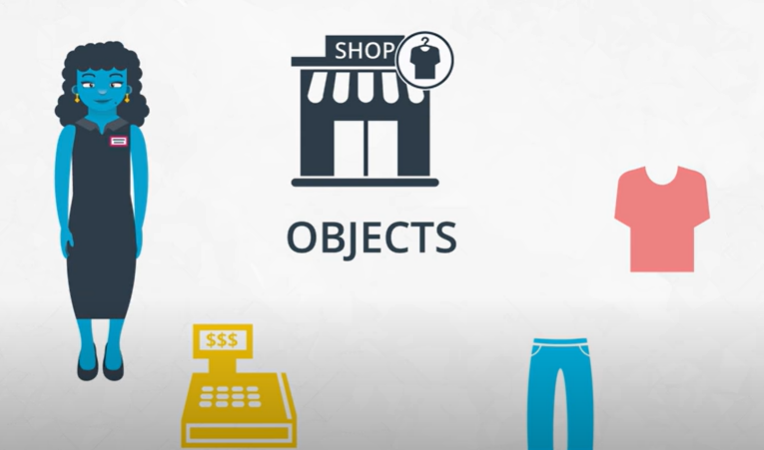
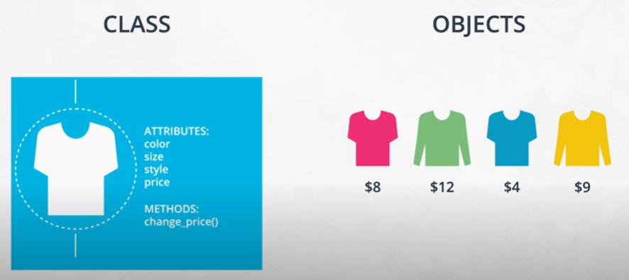

# Object-Oriented Programming - Part 1

## Why Object-Oriented Programming?
Object-oriented programming has a few benefits over procedural programming, which is the programming style you first learned.
- Object-oriented programming allows you to create large, modular programs that can easily expand over time.
- Object-oriented programs hide the implementation from the end-user.

Consider Python packages like scikit-learn, pandas, or numpy. These are all Python libraries built with object-oriented programming. Scikit-learn, for example, is a relatively large and complex package built with object-oriented programming. This package has expanded over the years with new functionality and new algorithms.

When you train a machine learning algorithm with scikit-learn, you don't have to know anything about the algorithm's code.

Here is an example taken from the scikit-learn website:

```
from sklearn import svm
X = [[0, 0], [1, 1]]
y = [0, 1]
clf = svm.SVC()
clf.fit(X, y)  
```

> How does scikit-learn train the SVM model? You don't need to know because the implementation is hidden with object-oriented programming.

(Depending on your needs, you might still want to understand how SVM works—but the point here is that the implementation is hidden from you as the end user and you don't need to understand the details of the implementation in order to use it. This is similar to how people commonly know how to drive a car without understanding exactly how things work under the hood.)

## Procedural versus Object-Oriented Programming

__Procedural program__ is a list of instructions that works one after the other starting from the top of the file and working down.

__Object-Oriented Programming__ are build around objects. Objects can be thought of as OBJECTS. 



Like in the example above, all can be coded and taken as an object. From shop, saleswoman, shirt, jeans, cash register, etc can be taken as an object. An object-oriented program will focus on the individual characteristics of an object and what each object can do. So an object has two essential parts:
- Characteristics, and
- Actions

Example characteristics of a salesperson will be: Name, Address, Phone number, Hourly pay, etc.   
Example actions of a salesperson will be: Selling an item, taking item from warehouse, etc. 

Example characteristics of a shirt will be: Color, Size, price, etc.   
Example actions of a salesperson will be: Change price, etc.

#### Characteristics and Actions in English Grammar
You can also think about characteristics and actions in terms of English grammar. A characteristic corresponds to a noun and an action corresponds to a verb.

Let's pick something from the real world: a dog. Some characteristics of the dog include the dog's weight, color, breed, and height. These are all nouns. Some actions a dog can take include to bark, to run, to bite, and to eat. These are all verbs.

## Class, Object, Method, and Attribute

Characteristics are known as __Attributes__.  
Actions are known as __Methods__.  

Classes are blueprints. Objects are created from blueprints and are different.  
So you need to create a blueprint only once and then you can create different objects over and over again.



### Object-Oriented Programming (OOP) Vocabulary
- __Class:__ A blueprint consisting of methods and attributes.
- __Object:__ An instance of a class. It can help to think of objects as something in the real world like a yellow pencil, a small dog, or a blue shirt. However, as you'll see later in the lesson, objects can be more abstract.
Attribute: A descriptor or characteristic. Examples would be color, length, size, etc. These attributes can take on specific values like blue, 3 inches, large, etc.
- __Method:__ An action that a class or object could take.
- __OOP:__ A commonly used abbreviation for object-oriented programming.
- __Encapsulation:__ One of the fundamental ideas behind object-oriented programming is called encapsulation: you can combine functions and data all into a single entity. In object-oriented programming, this single entity is called a class. Encapsulation allows you to hide implementation details, much like how the scikit-learn package hides the implementation of machine learning algorithms.


In English, you might hear an attribute described as property, description, feature, quality, trait, or characteristic. All of these are saying the same thing.

## Object-Oriented Programming Syntax

```
class Shirt:
    def __init__(self, shirt_color, shirt_size, shirt_style, shirt_price):
        self.color = shirt_color
        self.size = shirt_size
        self.style =  shirt_style
        self.price = shirt_price

    def change_price(self, new_price):
        self.price = new_price

    def discount(self, discount):
        return(self.price*(1-discount))

```

### Function versus Method
A function and a method look very similar. They both use the `def` keyword. They also have inputs and return outputs. __The difference is that a method is inside of a class whereas a function is outside of a class.__

### What Is `self`?
If you instantiate two objects, how does Python differentiate between these two objects?

```
shirt_one = Shirt('red', 'S', 'short-sleeve', 15)
shirt_two = Shirt('yellow', 'M', 'long-sleeve', 20)
```

That's where `self` comes into play. If you call the `change_price` method on `shirt_one`, how does Python know to change the price of `shirt_one` and not of `shirt_two`?

```
shirt_one.change_price(12)
```

Behind the scenes, Python is calling the `change_price` method:

```
def change_price(self, new_price):
    self.price = new_price
```

`Self` tells Python where to look in the computer's memory for the shirt_one object. Then, Python changes the price of the shirt_one object. When you call the `change_price` method, `shirt_one.change_price(12)`, `self` is implicitly passed in.

The word `self` is just a convention. You could actually use any other name as long as you are consistent, but you should use `self` to avoid confusing people.

## Set and Get Methods
Accessing attributes in Python can be somewhat different than in other programming languages like Java and C++.

The `Shirt` class has a method to change the price of the shirt: `shirt_one.change_price(20)`. In Python, you can also change the values of an attribute with the following syntax:

```
shirt_one.price = 10
shirt_one.price = 20
shirt_one.color = 'red'
shirt_one.size = 'M'
shirt_one.style = 'long_sleeve'
```

This code accesses and changes the price, color, size, and style attributes directly. __Accessing attributes directly would be frowned upon in many other languages, but not in Python. Instead, the general object-oriented programming convention is to use methods to access attributes or change attribute values.__ These methods are called `set` and `get` methods or `setter and getter methods`.

A `get method` is for obtaining an attribute value. A `set method` is for changing an attribute value. If you were writing a Shirt class, you could use the following code:

```
class Shirt:

    def __init__(self, shirt_color, shirt_size, shirt_style, shirt_price):
        self._price = shirt_price

    def get_price(self):
      return self._price

    def set_price(self, new_price):
      self._price = new_price
```

Instantiating and using an object might look like the following code:

```
shirt_one = Shirt('yellow', 'M', 'long-sleeve', 15)
print(shirt_one.get_price())
shirt_one.set_price(10)
```

In the class definition, the underscore in front of price is a somewhat controversial Python convention. In other languages like C++ or Java, price could be explicitly labeled as a private variable. This would prohibit an object from accessing the price attribute directly like `shirt_one._price = 15`. Unlike other languages, Python does not distinguish between private and public variables. Therefore, there is some controversy about using the underscore convention as well as get and set methods in Python.

#### Why use `get and set methods` in Python when Python wasn't designed to use them?

At the same time, you'll find that some Python programmers develop object-oriented programs using `get` and `set` methods anyway. Following the Python convention, the underscore in front of price is to let a programmer know that price should only be accessed with `get` and `set` methods rather than accessing price directly with shirt_one._price. However, a programmer could still access _price directly because there is nothing in the Python language to prevent direct access.

To reiterate, a programmer could technically still do something like `shirt_one._price = 10`, and the code would work. But accessing price directly, in this case, would not be following the intent of how the Shirt class was designed.

One of the benefits of `set and get methods` is that, as previously mentioned in the course, __you can hide the implementation from your user__. Perhaps, originally, a variable was coded as a list and later became a dictionary. With `set and get methods`, you could easily change how that variable gets accessed. Without `set and get methods`, you'd have to go to every place in the code that accessed the variable directly and change the code.

### Attributes
There are some drawbacks to accessing attributes directly versus writing a method for accessing attributes. In some languages, like C++, you can explicitly state whether or not an object should be allowed to change or access an attribute's values directly. Python does not have this option.

#### Why might it be better to change a value with a method instead of directly?
Changing values via a method gives you more flexibility in the long term. What if the units of measurement change, like if the store was originally meant to work in US dollars and now has to handle Euros? Here's an example:

#### Example: Dollars versus Euros

If you've changed attribute values directly, you'll have to go through your code and find all the places where US dollars were used, such as in the following:

```
shirt_one.price = 10 # US dollars
```

Then, you'll have to manually change them to Euros.

```
shirt_one.price = 8 # Euros
```
If you had used a method, then you would only have to change the method to convert from dollars to Euros.

```
def change_price(self, new_price):
    self.price = new_price * 0.81 # convert dollars to Euros

shirt_one.change_price(10)
```

## Commenting Object-Oriented Code

A docstring is a type of comment that describes how a Python module, function, class, or method works. Docstrings are not unique to object-oriented programming.

#### Docstrings and Object-Oriented Code

The following example shows a class with docstrings. Here are a few things to keep in mind:

- Make sure to indent your docstrings correctly or the code will not run. A docstring should be indented one indentation underneath the class or method being described.
- You don't have to define `self` in your method docstrings. It's understood that any method will have `self` as the first method input.

```
class Pants:
    """The Pants class represents an article of clothing sold in a store
    """

    def __init__(self, color, waist_size, length, price):
        """Method for initializing a Pants object

        Args: 
            color (str)
            waist_size (int)
            length (int)
            price (float)

        Attributes:
            color (str): color of a pants object
            waist_size (str): waist size of a pants object
            length (str): length of a pants object
            price (float): price of a pants object
        """

        self.color = color
        self.waist_size = waist_size
        self.length = length
        self.price = price

    def change_price(self, new_price):
        """The change_price method changes the price attribute of a pants object

        Args: 
            new_price (float): the new price of the pants object

        Returns: None

        """
        self.price = new_price

    def discount(self, percentage):
        """The discount method outputs a discounted price of a pants object

        Args:
            percentage (float): a decimal representing the amount to discount

        Returns:
            float: the discounted price
        """
        return self.price * (1 - percentage)
```

