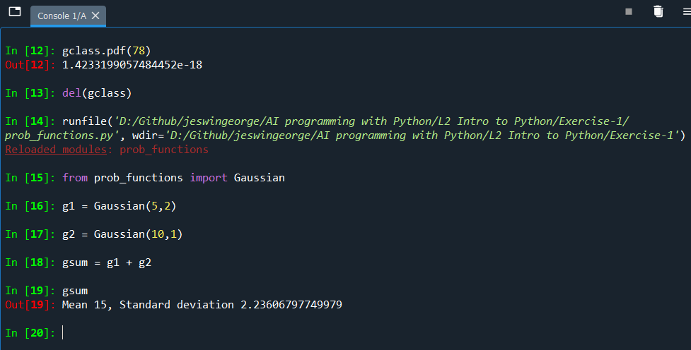

# Object-Oriented Programming - Part-2

## Using Magic methods

Reference:
1. [Python Magic Method](https://www.educba.com/python-magic-method/)

__Dunder or magic methods__ in Python are the methods having two prefix and suffix underscores in the method name. Dunder here means “Double Under (Underscores)”. These are commonly used for operator overloading. Few examples for magic methods are: `__init__`, `__add__`, `__len__`, `__repr__` etc.

The `__init__` method for initialization is invoked without any call, when an instance of a class is created, like constructors in certain other programming languages such as C++, Java, C#, PHP etc. These methods are the reason we can add two strings with ‘+’ operator without any explicit typecasting.

__Magic methods__ are a collection of pre-defined functional method from the python library functions that cannot be declared or called directly. Instead, these functions can be called or invoked by executing some other related code snippet methods. This type of methods are simple to use and implement, as it does not require specific or any kind of extra manual effort from the programmer. Hence it is named as the ‘Magic Method’.

#### Python Magic Methods
Python has many built-in magic methods to name some are:
- `__init__`  
- `__new__`  
- `__del__`  
- `__abs__`  
- `__add__`  
- `__sub__`  
- `__mul__`  

We will discuss some of the magic methods to understand it better.  
Now let’s take the `__ to add__` magic method:
```
A=5
A+3
```
__Output: 8__

The same can be performed with the `__add__` magic method.

```
A.__add__(5)
```
__Output: 10__

Here the operator plus is used for adding a numerical value to numerical variable A. The same can be performed using the built-in `__add__` magic method. However, as we have discussed, magic methods are not supposed to be called directly, but internally, through some other methods or actions.

In the Gaussian class, we have created we can add two gaussian objects using magic method which otherwise would not have been possible.


Magic method helps you to overwrite and rewrite the default Python behaviour. The `__add__` method overwrites the behaviour of `+` sign.

For example refer to the new function added to the `Gaussian()` class to add two gaussian objects. Using this we can add two gaussian objects.

```
def __add__(self, other):
        """Function to add together two Gaussian distribution
        
        Args:
            other (Gaussian): Gaussian instance
            
        
        Returns:
            Gaussian: Gaussian distribution
        """
        
        result = Gaussian()
        result.mean = self.mean + other.mean
        result.stdev = math.sqrt(self.stdev**2 + other.stdev**2)
        return(result)

```

The representation magic method `__repr__` controls what gets printed out. For example: In the example below we know the value of variable x when we just write it in console or print it.

```
x = 3
x
```

__Output: 3__

We can do that similarly for the gaussian class object.



