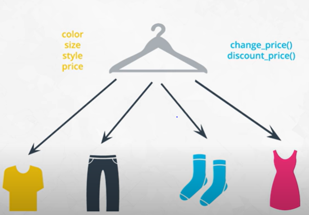

# Inheritance

Why code different classes for each new garment when they have so much in common with each other?


So we can create a Parent clothing class then the shirt, pant, sock and skirt can inherit the attributes and methods of the parent coding classs.



One benefit is that as we add more clothing type like blouses we can easily add a new class which inherit from the parent clothing class.
Now in future if we want to add a new attribute like material, we can add it to clothing class and the children class will automatically inherit it.

```
class Clothing:    
    def __init__(self, color, size, style, price):
        self.color = color
        self.size = size
        self.style = style
        self.price = price
        
    def change_price(self, price):
        self.price = price
       
    def calculate_discount(self, discount):
        return(self.price*(1-discount))


class Shirt(Clothing):
    def __init__(self, color, size, style, price, long_or_short):
        Clothing.__init__(self, color, size, style, price)
        self.long_or_short = long_or_short
        
    def double_price(self):
        self.price = 2*self.price
        
class Pants(Clothing):
    def __init__(self, color, size, style, price, waist):
        Clothing.__init__(self, color, size, style, price)
        self.waist = waist
        
    def calculate_discount(self, discount):
        return(self.price*(1-discount/2))
    
```

Shirt and Pants inherits all attributes and methods of Clothing class. Inside Shirts `__init__` method there is a new syntax where `Clothing.__init__(self, color, size, style, price)` is called. It means that the Shirt object is initialising itself with Clothings `__init__` method. Then we can add additonal attribute to the child class. Like in Shirt class we added  `long_or_short` attribute or `waist` attribute in Pants class.

We can also extend the Shirt or Pants class by adding new methods. Example we added `double_price()` method to Shirt class. We can also override any of the Parent classes' method for example the Pants class is overridng the `calculate_discount()` method of Clothing class.

***

# Advanced OOP Topics
Inheritance is the last object-oriented programming topic in the lesson. Thus far you've been exposed to:

Classes and objects
Attributes and methods
Magic methods
Inheritance
Classes, objects, attributes, methods, and inheritance are common to all object-oriented programming languages.

Knowing these topics is enough to start writing object-oriented software. What you've learned so far is all you need to know to complete this OOP lesson. However, these are only the fundamentals of object-oriented programming.

Use the following list of resources to learn more about advanced Python object-oriented programming topics.

- [Python's Instance, Class, and Static Methods Demystified](https://realpython.com/instance-class-and-static-methods-demystified/): This article explains different types of methods that can be accessed at the class or object level.
- [Class and Instance Attributes](https://www.python-course.eu/python3_class_and_instance_attributes.php): You can also define attributes at the class level or at the instance level.
- [Mixins for Fun and Profit](https://easyaspython.com/mixins-for-fun-and-profit-cb9962760556): A class can inherit from multiple parent classes.
- [Primer on Python Decorators](https://realpython.com/primer-on-python-decorators/): Decorators are a short-hand way to use functions inside other functions.