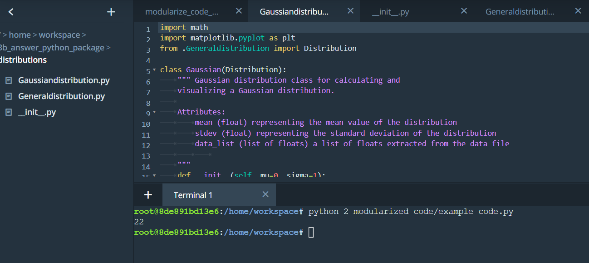
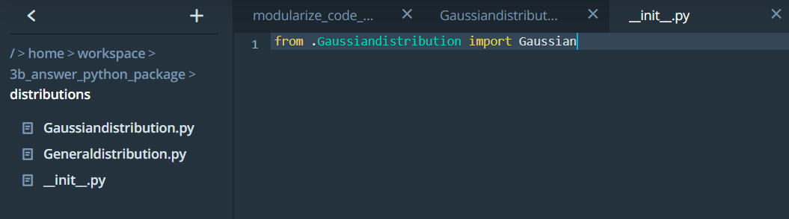
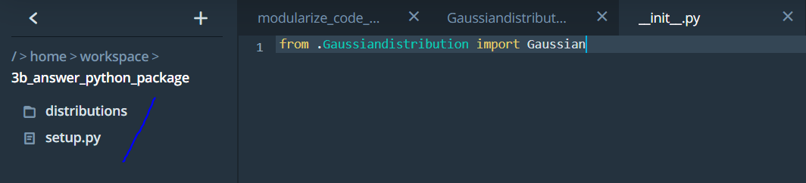
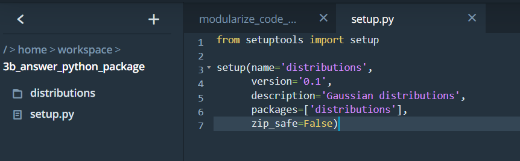
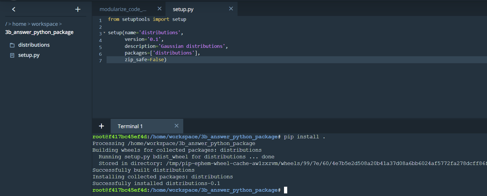
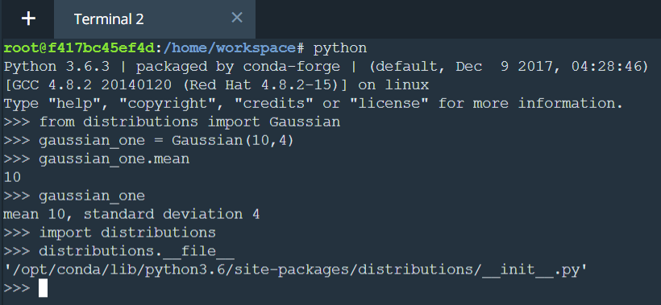
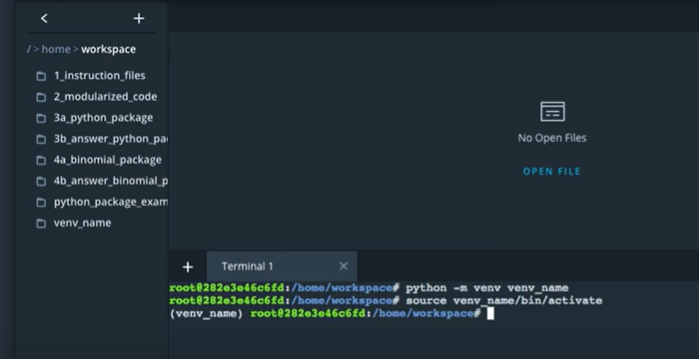
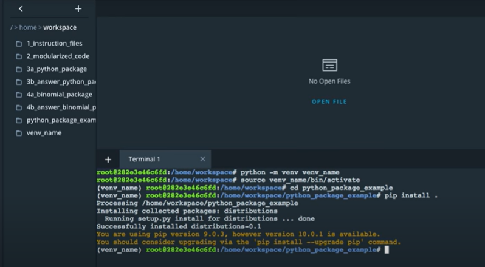

# Modules and Packages in Python

In Python, a __module__ is a single file that contains multiple functions, classes or global variables. They are called modules because they
are modular and these files can be used in multiple applications. A __package__ is a collection of modules placed into a directory. 

Packages and applications need not be in the same directory as long as python knows where to look for a package.

## What is `pip`?

pip is a [Python package manager](https://pip.pypa.io/en/stable/) that helps with installing and uninstalling Python packages. You might have used pip to install packages using the command line:  

```
pip install numpy
```

When you execute above command, pip downloads the package from a Python package repository called [PyPi](https://pypi.org/).

A package needs an `__init__.py` file.

## Setting up a python package to upload to PyPi

1. Setting up package locally so that it can be pip installed locally in your system. The distribution folder has the following files:
       - `Generaldistribution.py` (Parent class)
       - `Gaussiandistribution.py` (Child class) 
       - `__init__.py`

As the folder contains a `__init__.py` file so its a package. 


On opening __Gaussiandistribution.py__ in the 3rd line observe the dot (__.__) before __Generaldistribution__ in the line `from .Generaldistribution import Distribution`. This dot is required in Python 3 but if are working on Python 2 its not neeeded.

The `__init__.py` tells python that the folder __distributions__ contains a package. A package always needs to have an `__init__.py` file even though the file is empty.

The code inside `__init__.py` is run whenever you call the package inside a python program.

In this case, the `__init__.py` file is importing the `Gaussian` class from the `Gaussiandistribution` module. 



The reason the line `from .Gaussiandistribution import Gaussian` was added so that we can import the `Gaussian` class directly. The package will still work if the `__init__.py` file is empty but we will have to import the `Gaussian` class seperately.

Going one level up in the file directory we see a `setup.py` file at the same level as __distributions__ folder. This file is necessary for pip installing. Pip will automatically look for this file.



On opening the `setup.py` file. We can see the file contains information/metadata about the package.



To install the package go to the terminal and make sure that you are in directory with `setup.py` file.

And then in terminal type
```
pip install .
```



The `.` tells pip to lokk for `setup.py` file in the current folder. 
Now we can use the python package. The package gets installed in the location wherever pip installs it in your system.



To know where the package is installed use the following commands and magic method.

```
import distributions
distributions.__file__
```

If you want to develop a package locally on your computer, you should consider setting up a virtual environment. That way, if you install your package on your computer, the package won't install into your main Python installation.

#### Object-oriented programming and Python packages

A Python package does not need to use object-oriented programming. You could simply have a Python module with a set of functions. However, most—if not all—of the popular Python packages take advantage of object-oriented programming for a few reasons:

1. Object-oriented programs are relatively easy to expand, especially because of inheritance.
2. Object-oriented programs obscure functionality from the user. Consider `scipy` packages. You don't need to know how the actual code works in order to use its classes and methods.

# Virtual Environments
If you decide to install your package on your local computer, you'll want to create a virtual environment. A virtual environment is a silo-ed Python installation apart from your main Python installation. That way you can install packages and delete the virtual environment without affecting your main Python installation.

Let's talk about two different Python environment managers: `conda` and `venv`. You can create virtual environments with either one.

## `Conda`
`Conda` does two things: manages packages and manages environments.

As a package manager, `conda` makes it easy to install Python packages, especially for data science. For instance, typing `conda install numpy` installs the numpy package.

As an environment manager, `conda` allows you to create silo-ed Python installations. With an environment manager, you can install packages on your computer without affecting your main Python installation.

The command line code looks something like the following:
```
conda create --name environmentname
source activate environmentname
conda install numpy
```

## `pip` and `Venv`
There are other environmental managers and package managers besides conda. For example, `venv` is an environment manager that comes preinstalled with Python 3. `pip` is a package manager.

`pip` can only manage Python packages, whereas `conda` is a language-agnostic package manager. In fact, `conda` was invented because pip could not handle data science packages that depended on libraries outside of Python. If you look at the history of `conda`, you'll find that the software engineers behind `conda` needed a way to manage data science packages (such as NumPy and Matplotlib) that relied on libraries outside of Python.

`conda` manages environments and packages. `pip` only manages packages.

To use `venv` and `pip`, the commands look something like the following:
```
python3 -m venv environmentname
source environmentname/bin/activate
pip install numpy
```

## Which to choose
Whether you choose to create environments with venv or conda will depend on your use case. `conda` is very helpful for data science projects, but `conda` can make generic Python software development a bit more confusing; that's the case for this project.

If you create a `conda` environment, activate the environment, and then `pip` install the distributions package, you'll find that the system installs your package globally rather than in your local `conda` environment. However, if you create the `conda` environment and install `pip` simultaneously, you'll find that `pip` behaves as expected when installing packages into your local environment:

```
conda create --name environmentname pip
```

On the other hand, using `pip` with `venv` works as expected. `pip` and `venv` tend to be used for generic software development projects including web development. For this lesson on creating packages, you can use conda or `venv` if you want to develop locally on your computer and install your package.

`venv` we recommend for this project.

To create and activate environment `venv_name`:



Change directory and install the distributions package.


Now we have installed the distribution package to the virtual environment instead of the default local environment.
Benefit is we can experiment with Python, without affecting the default python installations.


