# [ARGPARSE Tutorial](https://www.youtube.com/watch?v=OxpBMNalsDM)

Processing command line argument in any programming language is considered a very basic thing. 

## PROBLEM STATEMENT
Here we are writing a program that takes 3 inputs:
1. First number
2. Second number
3. Operation (add, subtract and multiply)
Based on the inputs, we should get result of operations.

__argparse__ supports two types of arguments:
1. Positional
2. Optional

```
parser = argparse.ArgumentParser()
```
used to initialise object of parser class. And using the `parser` object we are going to add arguments. 
What argument we will be putting using command line can be added in this way - 1st parameter is name of argument and 2nd parameter is help.

Below we can see how to add arguments to parser:

```
parser.add_argument("number1", help = "First number")
parser.add_argument("number2", help = "Second number")
parser.add_argument("operation", help="operation")
```

Once arguments have been added to parser as shown above. And once you parse the arguments using `parser.aprse_args()` we get back object in `args`. `args` has value of arguments which user has passed using command line. 

```
args = parser.parse_args()
```

Now we can actually access the variables using `args` obejct.

```
print("First argument: ", args.number1)
print("Second argument: ", args.number2)
print("Operation argument: ", args.operation)
```

On running the script made since now:

```
import argparse

if __name__ == "__main__":
    parser = argparse.ArgumentParser()
    parser.add_argument("number1", help = "First number")
    parser.add_argument("number2", help = "Second number")
    parser.add_argument("operation", help="operation")
    args = parser.parse_args()

    print("First argument: ", args.number1)
    print("Second argument: ", args.number2)
    print("Operation argument: ", args.operation)
```
On running this code in termial with `-h` (help).

```
python argparse_tutorial.py -h
```

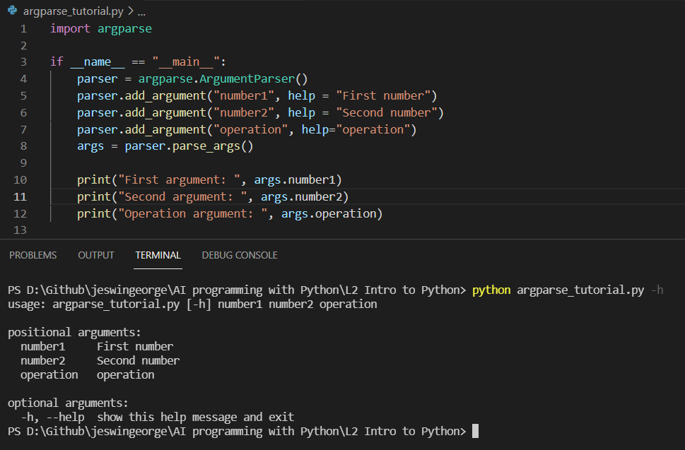

On using help we get format in which the argumnets must be put in the command line.

Now, lets add arguments from the command line.

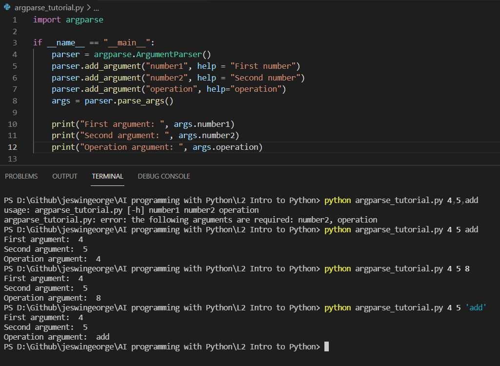

When passing arguments space (not comma) must be put between the arguments in command line. And if a string is being passed, quotes are a must.

When we input arguments using command line it comes into the program as a string we must convert it into integer or float based on the requirements.

Final script

```
import argparse

if __name__ == "__main__":
    parser = argparse.ArgumentParser()
    parser.add_argument("number1", help = "First number")
    parser.add_argument("number2", help = "Second number")
    parser.add_argument("operation", help="operation")
    args = parser.parse_args()

    print("First argument: ", args.number1)
    print("Second argument: ", args.number2)
    print("Operation argument: ", args.operation)

    n1 = int(args.number1)
    n2 = int(args.number2)
    result = None

    if args.operation == 'add':
        result = n1 + n2
    elif args.operation == 'subtract':
        result = n1 - n2
    elif args.operation == 'multiply':
        result = n1 * n2
    else:
        print("Unsupported Operation")

    print("Result of operation: ", result)
```

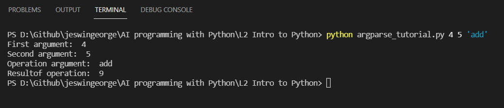

#### What happens if we do not give all positional arguments?
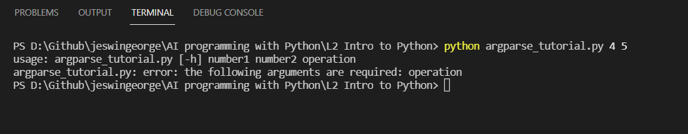

So to avoid errors due to argument not being shared in the command line argument we can use the optional arguments.

To make an argument optional just add `--` infront of the argument name. Like this:

```
parser.add_argument("--number2", help = "Second number")
parser.add_argument("--operation", help="operation")
```

Now on running the script again, observe the usage message. The usage message tells us the correct way of passing the arguments.

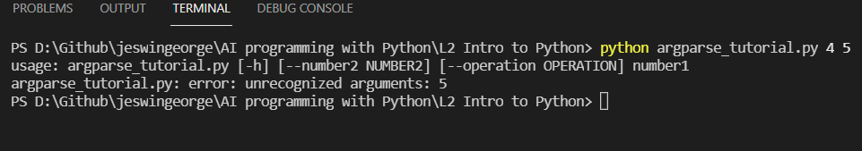

The correct way of apssing the argument is this:

```
python argparse_tutorial.py 4 --number2 5 --operation "add"
```
Observe for positional argument variable was not specified with __--__ but for optional arguments variable name was specified along with __--__.

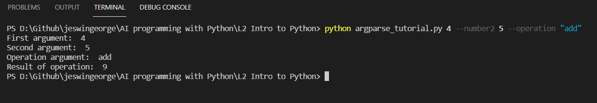

So using optional argument we get a clarity on which argument we are passing. So we can also change the order of variables we are assigning in the command line.

```
python argparse_tutorial.py 4 --operation "add" --number2 5
```
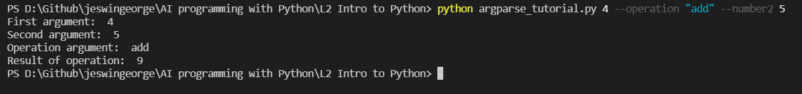

Now if we type and check help we will see optional arguments also.

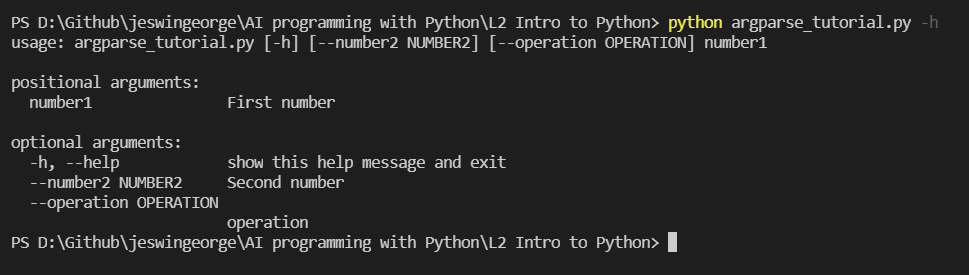

So with optional arguments if we skip any argument in the command line. It will still work i.e, it will not through an error and the script will still be run. And in the script programmer must make sure that the erroroneous inputs are met.
But what if we remove the condition where unexpected operation is handled. Then also we will not get error but `None` in result.

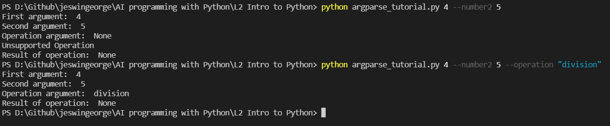

```
if args.operation == 'add':
    result = n1 + n2
elif args.operation == 'subtract':
    result = n1 - n2
elif args.operation == 'multiply':
    result = n1 * n2
```

But what if we want to restrict the run to input part of the code only i.e, the script must not run. We must specify choices in the 
`parser.add_argument("--operation", help="operation", choices=["add", "subtract", "multiply"])`.

If anything apart from the choices are given then we will get an error. And the script will not run below line 9 i.e, `args = parser.parse_args()`.

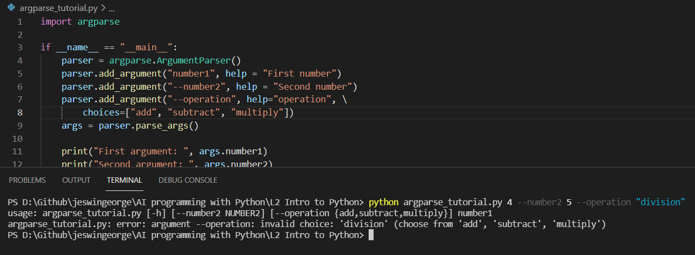


***

#### To run a python code from VS code terminal

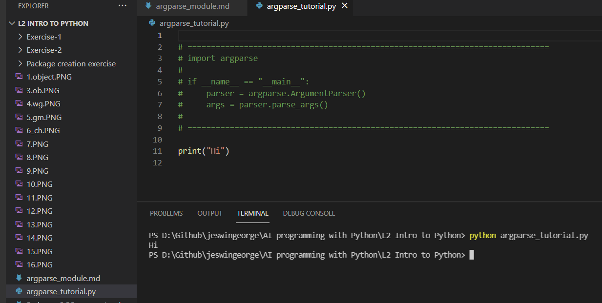

#### To run a python script from spyder IDE 

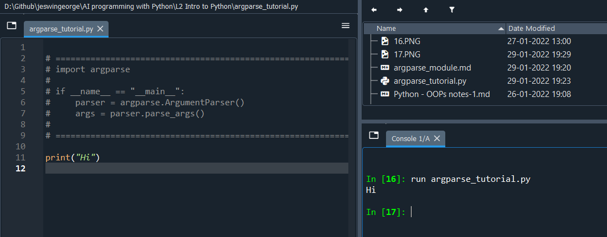
