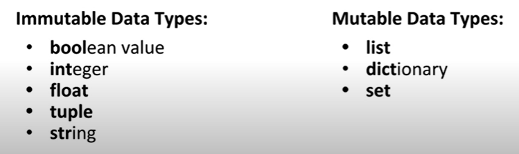
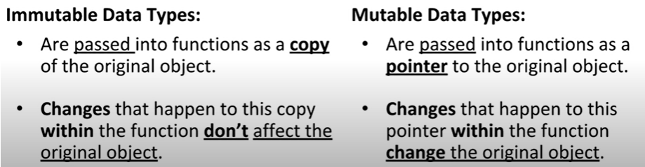
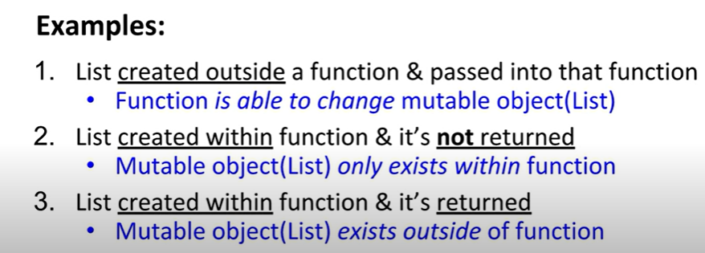
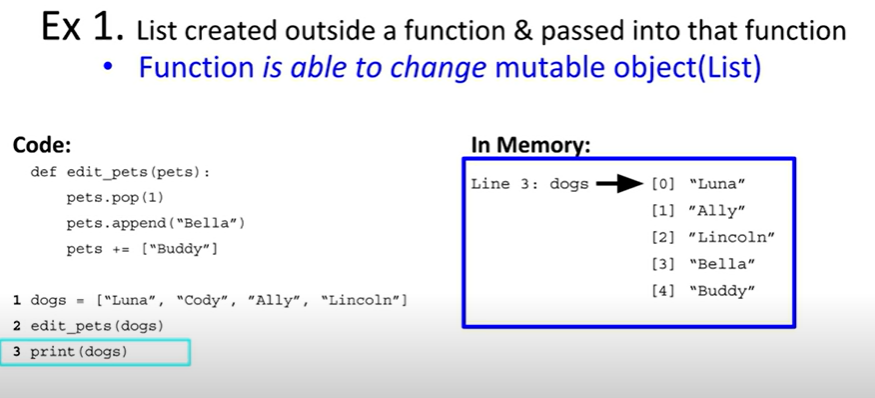
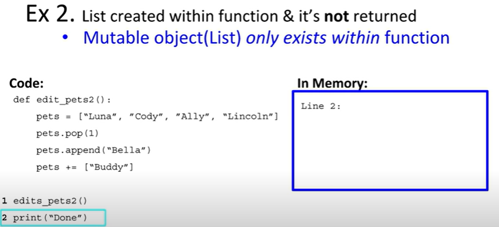
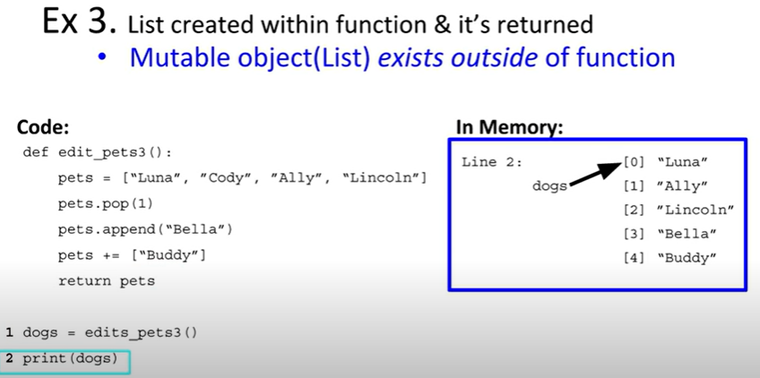

# Mutable Data Types and Functions

## Data Types
- __Mutable data types__ can be changed after they are created.
- __Immutable data types__ cannot be changed after they are created.

[Link to video tutorial for the below screenshots](https://youtu.be/LIOmuZdLymw)

