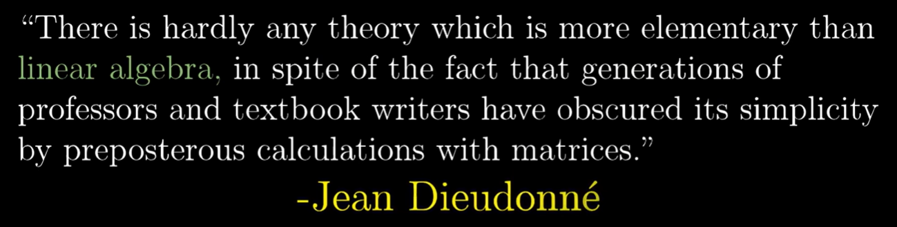
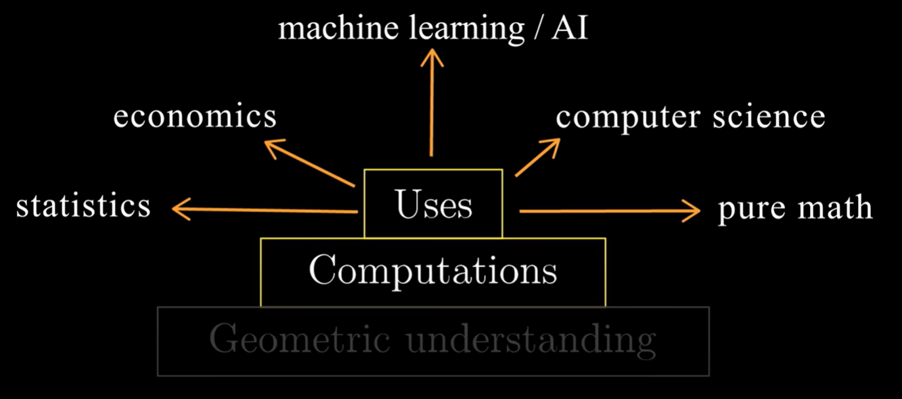

# Introduction to Linear Algebra

> Refer: [3Blue1Brown:Essence of linear algebra playlist](https://www.youtube.com/playlist?list=PLZHQObOWTQDPD3MizzM2xVFitgF8hE_ab)

Why matrix multiplication is done the way it is done? Why the cross-product has anything to do with determinant? What does eigen value represent?

__Need to understand linear algebra on a geometric level.__  
Geometric understanding helps us to judge:
- What tools to use to solve specific problems.
- Feel why they work.
- And know how to interpret the results.

And the numeric understanding helps us to carry through the application of these tools. 

### Structure of the Lesson

__This lesson will be broken down into four main parts:__

1. __Videos__- emphasizing the world of linear Algebra in a beautiful visual way.  
2. __Theory__- text elaborating on definitions and mathematical calculations, as well as theoretical quizzes. 
3. __Labs__- implementation of the theoretical concepts in code. 
4. __Neural Network intro__- Final lesson putting all the pieces together as we directly connect Linear Algebra to the world of Neural Networks. 

#### Latex equations

1. [Latex cheatsheet](https://www.authorea.com/users/77723/articles/110898-how-to-write-mathematical-equations-expressions-and-symbols-with-latex-a-cheatsheet)
2. [LaTeX Cookbook](http://www.personal.ceu.hu/tex/cookbook.html#inline)

