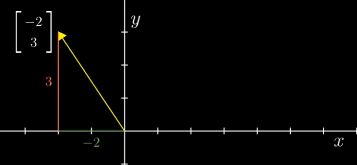
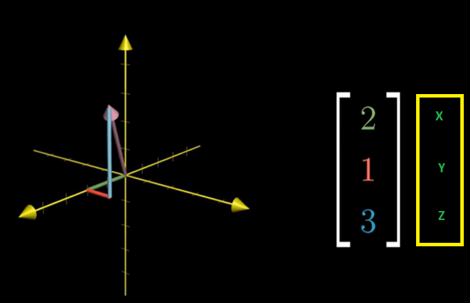
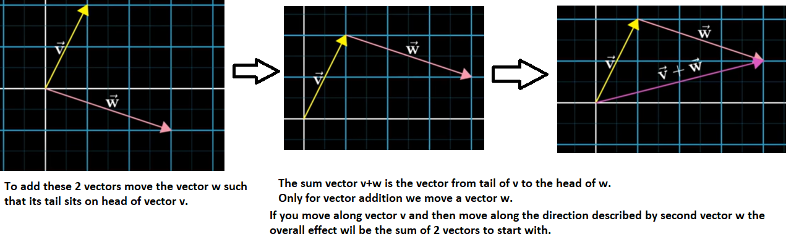
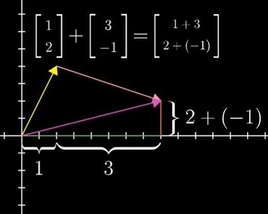
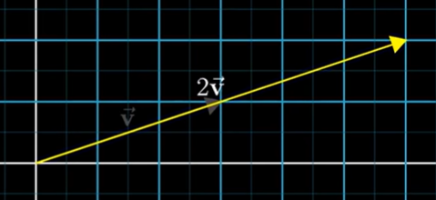
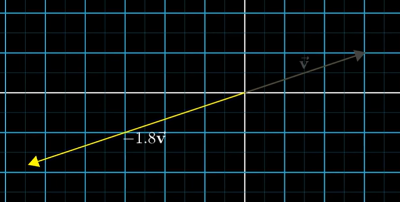
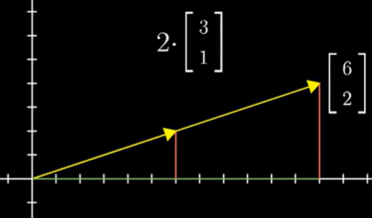

# Vectors

The plain explanation would be that a vector is an ordered list of numbers.  
Each element in the vector, also called __component or coordinate__, is a number, denoted here by $a_i$.  This specific vector (in the picture above ) has n elements and can be in the field of Real Numbers __R__.

A vector of _n_ real elements defines an n-dimensional vector and belongs to $R^n$.

This specific vector (in the picture above ) has nn elements and can be in the field of Real Numbers \mathbb{R}R.

A vector of nn real elements defines an nn dimensional vector and belongs to \mathbb{R}^nR 
n
 .

Coordinates of a vector are basically instructions on how to reach from tail of the vector to its head.  
Example: $\begin{bmatrix}-2 \\3 \end{bmatrix}$

To distinguish vectors from points the convention is to write these numbers vertically with square brackets as shown above. -2 refers to number of steps we need to take in x-axis and 3 refers to number of steps we need to take in y-axis.

The point for the same location will be (-2,3).

## Vector Addition :  $\overrightarrow{v} + \overrightarrow{w}$

Each vector represents a certain movement in space when we add these 2 vectors in such a way the resultant vector will have the same value as obtained. Its analogus to the way we do (2,0) + (5,0) = (7,0) in x-axis.  

## Multiply a vector by a number - Scaling

When you multiply a vector say $\overrightarrow{v}$ with a number x. Its like you strech out(or squeeze down if <1) that vector.

When you multiply a vector by a negative number first its flipped and then scaled or squeezed by the magnitude of that number.

Multiplying a vector by a number means multiply each of its number by that scalar.

> When diving into the world of __Artificial Intelligence (or what we refer to as AI)__, you will see that we frequently need to use linear combinations. 

