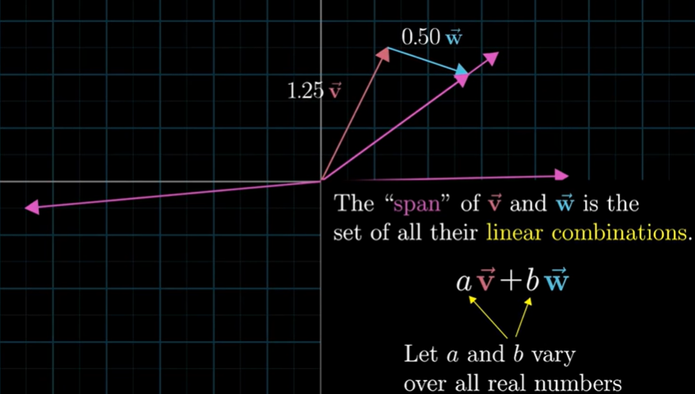
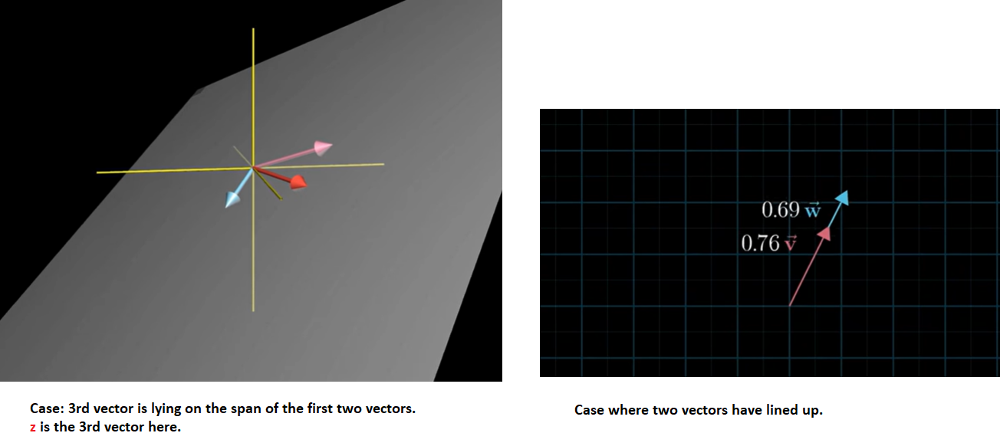
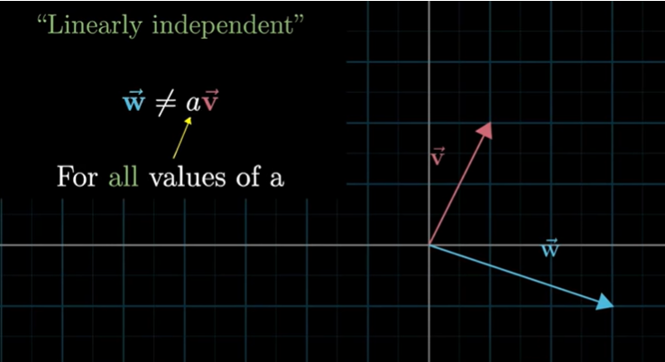
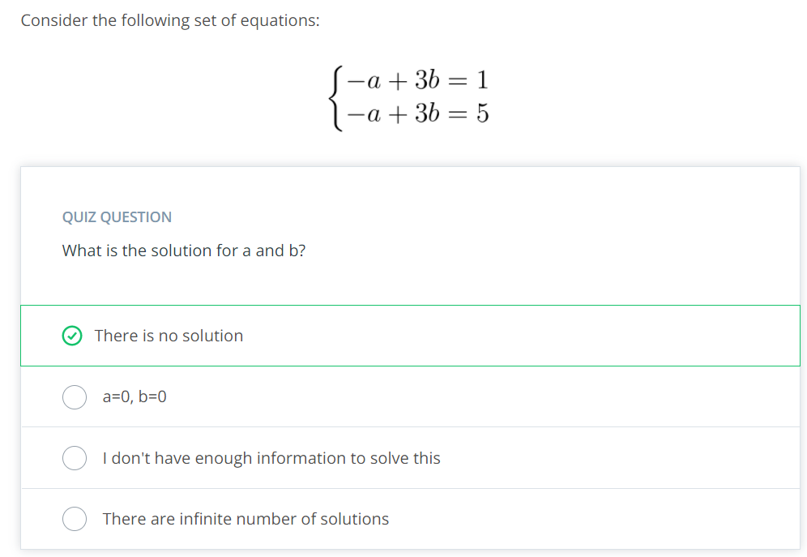

## Linear combination

$\hat{i}$ and $\hat{j}$ are __std basis vectors__ of the x-y coordinate system. They are unit vectors.

Using basis vectors to define a vector.

Linear combination of vectors assuming $\vec{v}$ and $\vec{w}$ are the basis vectors.

> [Why do we have linear word here? And what does vector combination have to do with lines?](https://youtu.be/fmal7UE7dEE)  
- When we fix one of the 2 vectors and let the other vector move around freely, the tip of the resultant vector will form a straight line.
- Now if we allow both the vectors to change as desired then the resultant vector can reach any point in the 2D space.

#### __Span of a vector__

Span of a vector is basically a way of asking what all points you can reach using two basis vectors and only two operations: addition and multiplication.

#### Span of 3D space

- If your 3rd vector happens to sit on the span of first two then your span would not change. In other words adding a scaled vector to the linear combination doesn't give you access to any new vector.
  [Linear Combinations - Span and Basis Vectors](https://youtu.be/RsKJNDTb8nw) - (2:40)

- If you randomly choose any 3rd vector which is not sitting on the span of the first two then it will unlock access to every possible 3D vector.  Think like this as you scale the 3rd vector, it moves around the span sheet of the first two sweeping it across all of the space. That is you are freely using the 3 vectors you have at your disposal.   

[Linear Combinations - Span and Basis Vectors](https://youtu.be/RsKJNDTb8nw) - (3:10)

***

Case where the 3rd vector was lying on the span of the first two or case where two vectors have lined up. We have a terminology to describe that aleast one of the vector is redundant and not adding anything to out span. Whenever this happens when you have multiple vectors and you can remove one without reducing the span the relevant terminology is to say that they are __linearly dependant__.

In case 1 above:Third vector can be expressed as the linear combination of the first two.

In case 2 below: $\hat{v}$ and $\hat{w}$ are linearly dependant. Or in other words, one of the vectors can be expressed as linear combination of others as its already in the span of others.

If each vector adds another dimension to the span then they are __linearly independent__.

#### Theoretical definition  

 __Basis__: The basis of a vector space is a set of linearly independent vectors that span the full space.

In general terms, the simple definition of a __linear combination__ is a multiplication of a scalar to a variable and addition of those terms.

For example:

If _x_, _y_ and _z_ are vectors  
and $a_1$, $a_2$ and $a_3$ are scalars. 

the following equations will be a linear combination:

$ v =  $a_1$x + $a_2$y + $a_3$z   $

__Span__ of $\hat{v}$ and $\hat{w}$ is the set of all their linear combinations.

If $\hat{v_1}, \hat{v_2}, \hat{v_3},..,\hat{v_n} \epsilon R$  
The __Span__ of those vectors (sometimes also referred to as the Linear Span) is the set of all possible linear combinations of those vectors.

Mathematically, the span of the set of vectors $\vec{v_1}, \vec{v_2},....., \vec{v_n}$ is written as:  $S_p(\vec{v_1}, \vec{v_2},....., \vec{v_n})$.

For example:
The three following vectors:

$ \vec{v_1} = \begin{bmatrix}1 \\0 \\0 \end{bmatrix}$,
$ \vec{v_2} = \begin{bmatrix}0 \\1 \\0 \end{bmatrix}$,
$ \vec{v_3} = \begin{bmatrix}0 \\0 \\1 \end{bmatrix}$

span any vector in $R^3$.

To prove that, we will take a random vector:

$\vec{v} = \begin{bmatrix}p \\q \\r \end{bmatrix}$

and show that it can be generated as a linear combination of of vectors $\hat{v_1}, \hat{v_2}, \hat{v_3}$.

In a quick observation we can see that:

$\vec{v} = p\begin{bmatrix}1 \\0 \\0 \end{bmatrix} +  q\begin{bmatrix}0 \\1 \\0 \end{bmatrix} +  r\begin{bmatrix}0 \\0 \\1 \end{bmatrix}$

***
## Quiz

The following is a set of three vectors:

$ \vec{v_1} = \begin{bmatrix}1 \\2 \\3 \end{bmatrix}$,
$ \vec{v_2} = \begin{bmatrix}2 \\2 \\2 \end{bmatrix}$,
$ \vec{v_3} = \begin{bmatrix}8 \\8 \\8 \end{bmatrix}$

All three vectors are $\epsilon R$.

Which vectors above define a plane spanned by a linear combination?

> Ans:

A simple glance at vectors $\vec{v_2}$ and $\vec{v_3}$ will show you that one vector can be defined as a linear combination of the other.

For example:
$ \vec{v_2} = 0.25 \vec{v_3}$

$\begin{bmatrix}2 \\2 \\2 \end{bmatrix} = 0.25\begin{bmatrix}8 \\8 \\8 \end{bmatrix}$

In other words, if we use $\vec{v_2}$ as a part of our linear combination (for creating finding the vectors spanned), we do not need $\vec{v_3}$. And vice versa: if we use $\vec{v_3}$ as a part of our linear combination (for creating finding the vectors spanned), we do not need $\vec{v_2}$.

Therefore, to define the plane spanned by a linear combination of the vectors above, we need ($\vec{v_2}$ and $\vec{v_1}$) or ($\vec{v_3}$ and $\vec{v_1}$).

When one vector can be defined as a linear combination of the other vectors, they are a set of __linearly dependent__ vectors.

When each vector in a set of vectors vector can not be defined as a linear combination of the other vectors, they are a set of __linearly independent__ vectors.

In our example,
- $\vec{v_2}$ and $\vec{v_3}$  is a linearly dependent set.
- ($\vec{v_2}$ and $\vec{v_1}$) and ($\vec{v_3}$ and $\vec{v_1}$) are linearly independent set.

The easiest way to know if a set of vectors is linear dependent or not, is with the use of __determinants__.

## Solving a Simplified Set of Equations
A linear combination of vector by scalars brings us to our next important topic: __A system of Linear Equations__.

In this Linear Algebra lesson we will dive only into a system of two linear equations with two unknowns.

In a broader Linear Algebra class you will find more information about a system of nn linear equations, where _n_ can be any number.

Assume that we have two vectors:

- $ \vec{x} = \begin{bmatrix}-14 \\2 \end{bmatrix}$
- $ \vec{y} = \begin{bmatrix}5 \\-1 \end{bmatrix}$

and we would like to represent a new vector
$\begin{bmatrix}-13 \\3 \end{bmatrix}$ as a linear combination of $\vec{x}$ and $\vec{y}$.

In other words, we are looking for a two scalars, lets call them a and b, that will hold the following equation:

$a\begin{bmatrix}-14 \\2 \end{bmatrix} + b \begin{bmatrix}5 \\-1 \end{bmatrix} = \begin{bmatrix}-13 \\3 \end{bmatrix}$

We now know how to multiply a vector by a scalar and addition, after doing that we get two equations:

$-14a + 5b = -13$  
$2a -b = 3 $

The Above set of equations is referred to in literature as a __set of two equations with two unknowns__.

This set can be solved using three theoretical methods:

- Graphical method
- Substitution method
- Elimination method

***

#### Quiz-1

#### Quiz-2

Cases when we can have a solution:

