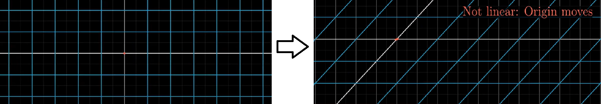

# Matrices

### Multiplication of Square Matrices
The easiest multiplication to consider is that of two __square matrices__ of the same dimensions nnxnn.

A square matrix is a matrix that has the same number of rows and columns.

if A is an `n × m` matrix and B is an `m × p` matrix, their matrix product AB is an `n × p` matrix, in which the m entries across a row of A are multiplied with the m entries down a column of B and summed to produce an entry of AB. When two linear transformations are represented by matrices, then the matrix product represents the composition of the two transformations.

Since matrices A x B ≠ B x A we say they there are __not commutative__. This is a very interesting observation, as multiplication of scalars is definitely commutative.

## Linear Transformation and Matrices : Part 1

Transformations => Function (i.e., it takes an input vector and spits out an output vector)

__Transormation__ suggests that you think using movement.

Linear means it must satisfy two properties:
1. All lines must remain lines without getting curved.
2. Origin must remain fixed in place.
3. Grid lines involved must be parallel and evenly spaced.

For example:  
The images below shows what will not be a linear transformation:  

- Not linear as lines get curvy.
  

- Not linear as the orign moves.  
  

- Not linear as it changes the diagonal line to a curve.
  

 
## Linear Transformation and Matrices : Part 2
#### How would you describe the linear transformation numerically?  

We only need to record  where the two basis vectors -  $\hat{i}$ and $\hat{j}$ will land and everything else will follow from that.

__If we place some transformation and trace where all three of these vectors go:__  
The property that Grid lines must be parallel and evenly spaced has a important consequence the place where $\vec{v}$ lands is -ve 1 times the vector $\hat{i}$ had landed and plus 2 times the vector where  $\hat{j}$ had landed.

So we can deduce where we must go based on where $\hat{i}$ and $\hat{j}$ lands.

So keeping the copy of original grid in the background. 

We can see that the transformed $\hat{i}$ lands on coordinate (1,-2) and $\hat{j}$ lands on coordinate (3,0). 
Now on adding the transformed vectors we can deduce that the resultant vector will land on (5,2) or 

So the complete transformation can be described by just four numbers the two coordiantes where $\hat{i}$ lands and the two coordiantes where $\hat{j}$ lands.

We can package these 2 coordiantes into 2x2 grid of numbers as  2x2 matrix where columns can be interpreted as two special vectors where $\hat{i}$ and $\hat{j}$ lands.

If you are given a 2x2 matrix (as above) descibing a linear transformation and some specific vector and you want to know where that linear transformation takes that vector. You can take the the coordinates of that vector and multiply them by corresponding columns of that matrix and then add together what you get. This corresponds with the idea of adding the scaled  versions of our two new basis vectors.

## Linear Transformation and Matrices : Part 3

Lets take a general case where your matrix has entries: $ \begin{bmatrix}a & b \\c & d \end{bmatrix}$. This matrix is just way of packaging the information needed to describe the linear transformation.

Always interpret the first column $ \begin{bmatrix}a \\c \end{bmatrix}$ as the place where the first basis vector lands. And the second column $ \begin{bmatrix}b \\d \end{bmatrix}$ as the place where the second basis vector lands.

When we apply this transformation to any vector $ \begin{bmatrix}x \\y \end{bmatrix}$, we get

We can even define this as matrix vector multiplication when we put matrix to left of the vector and multiply:  

Observe the resultant vector as linear combination of the transformed basis vectors.

#### Example of some linear transformations with matrices:

1. Rotate all of the plane 90 counter-clockwise:   
 $\hat{i}$ lands on the coordinate $ \begin{bmatrix}0 \\1 \end{bmatrix}$ and $\hat{j}$ lands on the coordinate $ \begin{bmatrix}-1 \\0 \end{bmatrix}$.    
 To  figure out happens to any vector $ \begin{bmatrix}x \\y \end{bmatrix}$ after 90 rotation you have to just multiply the coordinates with this matrix.

 

2. __Shear__ transformation: Here $\hat{i}$ remains fixed but $\hat{j}$ moves over to (1,1) which becomes the 2nd column of our matrix $\begin{bmatrix}1 & 1 \\0 & 1 \end{bmatrix}$.

Now to see how the shear transforms a vector $ \begin{bmatrix}x \\y \end{bmatrix}$ multiply the vector with matrix.

So, linear transformations are way to move around spaces such that the grid lines can remain parallel and evenly spaced.

 