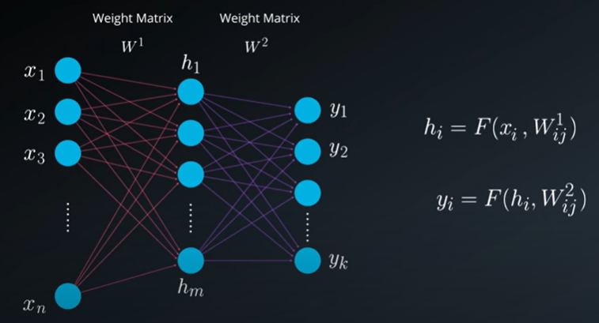

Here, we will give you an oversimplified idea of what a neural network is for the purpose of understanding how beautifully Linear Algebra is an ingrained component in it's application. In a nut shell, please focus on the math and how it's applied. It's OK if a few topics related directly to neural networks are still left unclear, as the entire neural network lesson is coming up soon.

## What is a Neural Network?

Neural networks is an important area of research in neuroscience. When we, as computer scientists, engineers, or other professionals outside the scope of pure neuroscience refer to neural networks, we actually mean __artificial neural networks__.

The design of the __Artificial Neural Network__ was inspired by the biological one. __The neurons used in the artificial network below are essentially mathematical functions__.

Each network has:

- __Input neurons__- which we refer to as the input layer of neurons
- __Output neurons__- which we refer to as the output layer of neurons  
- __Internal neurons__- which we refer to as the hidden layer of neurons. Each neural network can have many hidden layers.

The following picture is of a simple neural network with a single hidden layer.

This version of a simplified artificial neural network is comprised out of:

## How Are The Neurons Connected?

Refer the pic below:  

Notice the "lines" connecting the different neurons?

- In practice, these lines symbolize a coefficient (a scalar) that is mathematically connecting one neuron to the next. These coefficients are called __weights__.
- The "lines" connect each neuron in a specific layer to __all__ of the neurons on the following. For example, in our example, you can see how each neuron in the hidden layer is connected to a neuron in the output one.

Since there are so many __weights__ connecting one layer to the next, we mathematically organize those coefficients in a matrix, denoted as the __weight matrix__.

Spoiler:

Later you will learn that __when we train an artificial neural network, we are actually looking for the best set of weights that will give us a desired outcome__. We will not focus on that here, in the context of Linear Algebra.

OK! So what does all of this have to do with Linear Algebra?! Lets see!

## Putting The Pieces Together

We will use subscripts as well as superscript as a numeric notation for the weight matrix.

For example:  
- $W_k$ is weight matrix k.
-  $W_{ij}^{k}$ is the `ij` element of weight matrix k.

There is no limit to the number of inputs, number of hidden neurons in a layer and number of outputs, nor are there any correlation between those two numbers.  

> So we can have `n` inputs, `m` hidden neurons and `k` outputs.

In a closer even more simplistic look, we can see that each input is multiplied by its corresponding weight and added at the next layers neurons with a bias as well.

The bias is an external parameter of the neuron and can be modeled by adding an external fixed value input. 

This entire summation will go through an activation function to the next layer or to the output. 

#### But what is our goal?

We can look at our system as a black box that has n inputs and k outputs. Our goals is to design the system in such a way that it will give us the correct output y for a specific input x.

Our job is to decide what is inside the black box.

__Essentially, what we want is to find the the optimal set of weights connecting the input to the hidden layer and the optimal set of weights connecting the hidden layer to the output.__

We will never have a perfect estimation but we will try to be as close to it as we can.

When working with neural networks we have 2 primary phases:
- __Training__: During the training phase, we take the data set (also called the training set), which includes many pairs of inputs and their corresponding targets (outputs). Our goal is to find a set of weights that would best map the inputs to the desired outputs.  
- __Evaluation__: In the evaluation phase, we use the network that was created in the training phase, apply our new inputs and expect to obtain the desired outputs.

The training phase will include two steps:
- Feedforward
- Backpropagation

We will repeat these steps as many times as we need until we decide that our system has reached the best set of weights, giving us the best possible outputs.

To show you how relevant Linear Algebra is here, we will focus on the feedforward process. And again, focus on the mathematical calculations.

## The Feedforward Process- Finding $\vec{h}$ 

In this section we will look closely at the math behind the __feedforward process__. 

Assuming that we have a single hidden layer, we will need two steps in our calculations. 
1. The first will be calculating the value of the hidden states and 
2. the second one will be calculating the value of the outputs.

Notice that both the hidden layer and the output layer are displayed as vectors, as they are both represented by more than a single neuron.

Lets assume we have n inputs, 3 hidden layers and 2 outputs. $W_1$ as the set of weights from X to H and $W_2$ as set of weights from H to Y. (In practic. we can have 1000s of hidden neurons in a single hidden layer.)

As we have only 1 hidden layer we will have only 2 steps in each feedforward cycle. 

- Step 1: Finding h from a given input and the set of weights $W_1$.
- Step 2: Finding output y from calculated h and set of weights $W_2$.

Other than the use of the activation function all other calculation make use of linear combinations of inputs and weights or in other words we will use matrix multiplication.

#### Step 1: Finding h

To make sure that values of h (calculated above) do not explode or increase too much in size we need an activation function.

## The Feedforward Process- Finding $\vec{y}$ 

The process of calculating the output vector is mathematically similar to that of calculating the vector of the hidden layer. We use, again, a vector by matrix multiplication. The vector is the newly calculated hidden layer and the matrix is the one connecting the hidden layer to the output.

To have a good approximation of output y we might need more than 1 level of hidden layer. The number of neurons in each level of hidden layer can change from one level to the next and the number of neurons can even reach 1000s.

