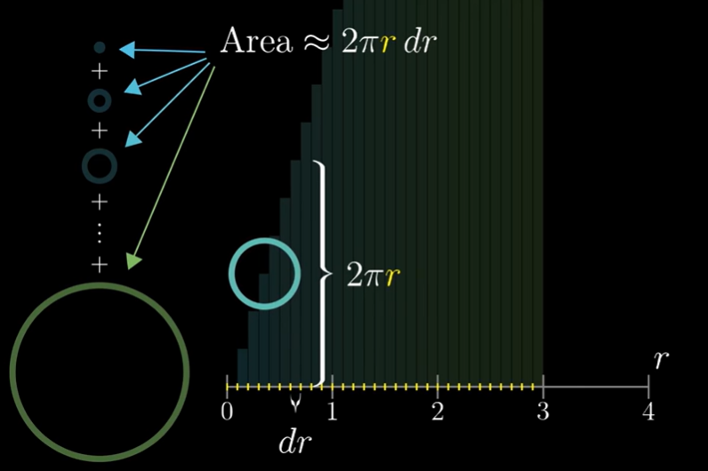
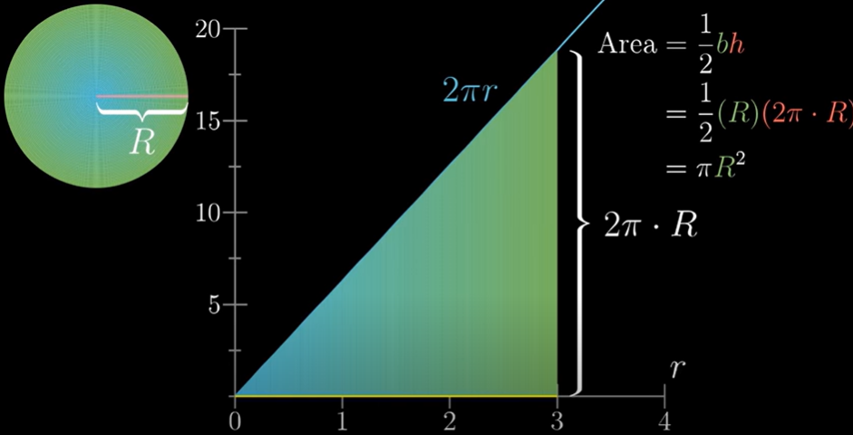
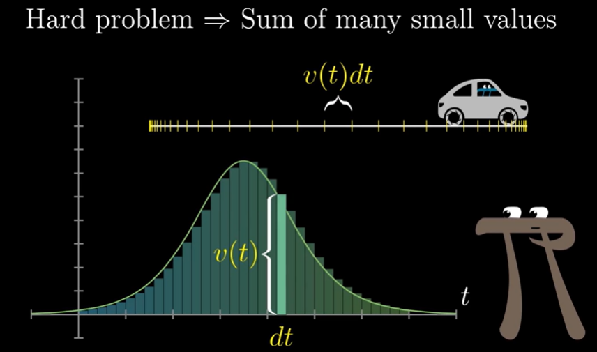
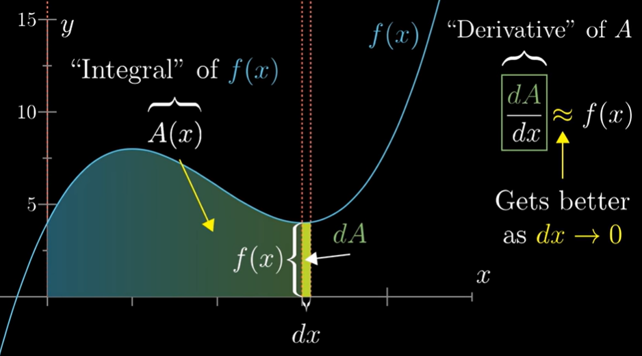
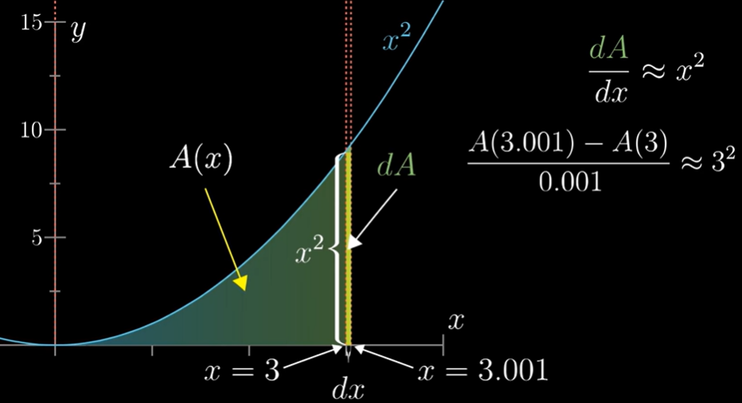
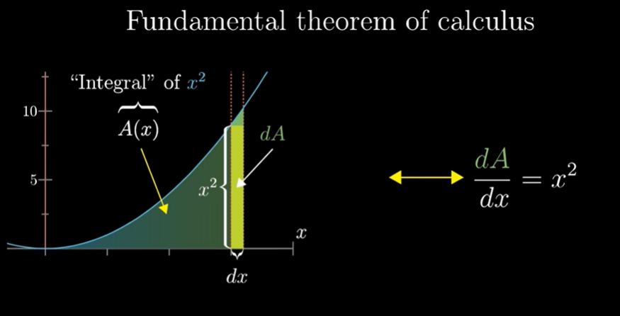

# Essence of Calculus 

Calculus techniques are essential in the training process of a neural network. The majority of this lesson will focus purely on these techniques while the end will emphasize how all this related to machine learning.

## Approximating the area of a circle

We had broken down the whole circle into smaller concentric circles. Obesrve the importance of __dr__. 

Not only is __dr__ a factor in quantites we are adding up, it also gives the spacing between the different values of __r__.

> We have split a big problem into sum of many small values.

Example figuring out how far the car has travelled based on its velocity at each point in time.    
At high level many of these types of problems, turn out to be equivalent of the area under the graph (any distribution).   
 

Area calculation becomes difficult when we try to find the area under the graph for different curves such as $x^2$, $x^3$, etc. We divide the graph into smaller rectangles of small areas and find out its area known as difference in Area dA. dA is made up of dx which is the width of the small rectangle and length will be f(x).
And when dx -> 0, we get the f(x) value at x. That is known as __derivative__.

Example of the above statement when $f(x) = x^2$:

Derivative is a measure of how sensitive a function is to small changes in its inputs. 

So, integral and derivatives are inverse of each other.

