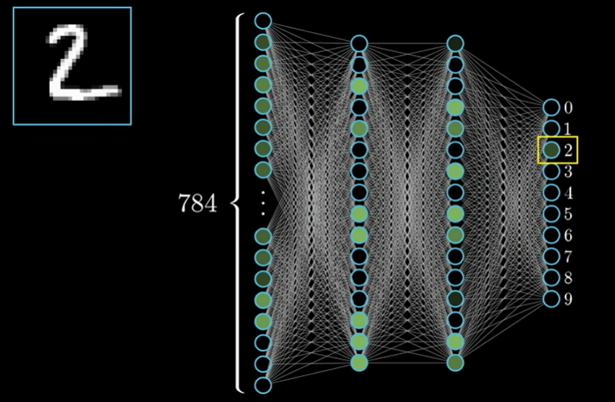
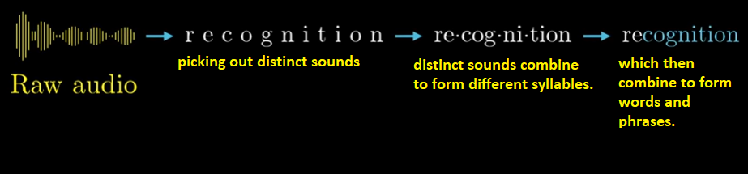
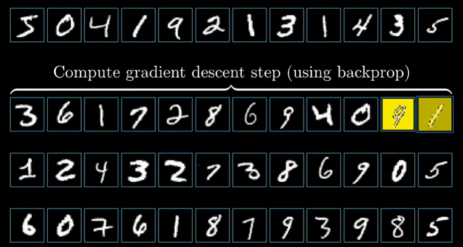

# [What is a Neural Network?](https://youtu.be/hYB4ku0kmW8)

Some applications of neural networks:
1. Convolutional neural network -> Good for image recognition
2. Long short-term memory network -> Good for speech recognition

In this chapter, we will be understanding the structure component of neural network.  

Using example:  
A neural network to recognize hand-written digits.

Detecting 2:  

Detecting 7:   

Assume:  
when we say a `neuron` -> Its a thing that holds number between 0 and 1. 

The network starts with a bunch of neurons corresponding to each of the 28x28 pixels of the input image which is 784 neurons in total. Each of these holds a number which represents the grey scale value of the corresponding pixel ranging from __0 for black pixel__ to __1 for white pixel__. This number inside the neuron is called __activation__. So you can observe that each neuron is lit up when its activation is a high number. So all of these 784 neurons make up the first layer of our network as seen in image below. And the last layer consists of 10 neurons each represnting one of the digits. The activation in each of the 10 neuron corresponds to how much a given image corresponds to a given digit. Lets ignore the hidden layers in between the first and last layer.

The way the system operates is how activation in one layer affects the activation in subsequent layers.

## Why do we expect the middle layers to behave in this intelligent way?

When we recognize digits we piece together certain components. 

We expect each neuron in 2nd to last layer will corresponds to the different components which help us to recognize digits:

So  any loopy pattern towards the top may set off the neurons for numbers like  8 and 9. 

So going from 3rd last layer to last requires learning which combination of sub-components (loop at top and a perpendicular line) corresponds to which digit (9 in this case). 

But even loops are made up of various different edges:

Also, the long line which you see in digts like 4,1 and 7 is also of different types.

So we can assume the neurons in the 2nd layer of network corresponds to the little edges. 

So layer by layer we predict or determine edges, loops or components and add them up together using activation to get the final output.

> We will see whether the actual neural network does as above or not in the subsequent sections.

Hence this is very useful in image recognition. Even beyond image recognition many recognition can be broken down like this into layers of abstraction.
Eg:   

__Image recognition:__

SO the pixels with higher wieghts will appear as light and the pixels with lower or negatrive weights will be darker.

As our activation should be in range of 0 to 1 only so we will need the weighted sum $w_1a_1 + w_2a_2 + .... + w_na_n$ to lie between 0 and 1. 

A function which does this is sigmoid function.

Bias tells you how high the weighted sum needs to be before the neurons starts getting meaningfully active.

We are talking about only 1 neuron above, all other neurons in the hidden layer will be connected to the 784 neurons from the first layer. 

Every neuron in the 1st hidden layer will be connected to all 784 pixel neurons from the 1st layer (input). The bias and weight for the neurons in the 1st hidden layers might be different.

So overall this network has 13,002 weights and biases. 13,002 weights and biases which can be tweaked to make this network behave in a certain way.

So learning => Finding the right weights and biases.

The sigmoid function can be written as:

So the overall equation can written as:

W - represents the weight matrix.

***

## Gradient Descent

Gradient Descent is used not only in neural networks but also in other machine learning algorithms.

Lets start by initializing all the weights and biases totally randomly.

Needless to say the network hence made will perform horribly on a training example as its doing something random.
For example when you feed in a image of `3` it will give incorrect result.

So we will define a cost function its a way of telling computer that the output is wrong and the activation should have been __0__ for all neurons and __1__ for the neuron indicating output `3`.

To say it mathematically we add up the the squares of the differences between the wrong output activations and the correct output activations that we want to have. And this is what we call the cost of a single training example.

Observe the sum is high when the classification is wrong and very low (as shown below) when the classification is done correctly.

So we find the average of the cost function for all of the 10k training example at your disposal. This average cost is the measure for how lousy the network is. 

Observe the complexity:  
The neural netwok is already a function with its own complexities.

The cost function is a layer of complexity to the top of the neural netwok function. It takes as its inputs the 13002 weights/biases an spits out a number (cost) that describes how bad the weights and biases are and the way its defined depends on the networks behavior on the tens and thousands of training data. 

Now depending on the cost function, we need to tell the computer how to change the weights and biases to improve.

We can do that by finding the minimum value of the cost function i.e, by fincing the point at which the slope is zero. But there is no guarantee that we will find the smallest point.

Finding:  
- local minima => Doable   
- Global minima => Very difficult

If we make our step size proportional to the slope your steps get smaller and smaller and that kind of helps you from overshooting.

We can also try the following example in 3D to know in which direction to move to decrease the value of C(x,y).

__Gradient of the function__ gives the direction of steepest ascend i.e, which direction we need to move to increase the value most quickly.

__Negative Gradient of the function__ gives the direction of steepest descend i.e, which direction we need to move to decrease the value most quickly.

The length of the gradient vector indicates how steep the steepest slope is.

The algorithm for minimizing the function is to compute the gradient direction and take a small step in that direction (i.e, downhill) and repeat that over and over.

This idea will be same for problems with 13000 inputs or for 2 inputs.

The negative gradient of the cost function is a vector and its a direction inside this insanely huge input space and tells which nudges inside the huge weight function will cost a rapid decrease in cost function. 

__Remember that the cost function is averaged all over the training data. Negative gradient tells us how to efficiently reduce the cost.__

The algorithm for computing the gradient efficiently which is efficently the heart of how a neural network learns is called __backpropagation__.

__So what we mean by the network learning is actually minimizing the cost function.__

Its important for cost function to have nice smooth output so that we can find local minima by taking little steps downhill.

So unlike biological neurons which we have binary activations such as 0 or 1, the artificial neural netwoks activation has continual values between 0 and 1.

This process of repeatedly nudging the input of a function by some multiple of the negative gradient is called __gradient descent__. Its a way to converge towards some local minimum of cost function. 

In the figure above we are showing the graph for 2 inputs as it will be difficult to visualize the graphs in 13000 input dimensions.

Neural networks is the beginning point we have developed it to convolutional neural network and LSTM.

***

## Backpropagation
Its the core algorithm behind how neural network learn.

Now consider cases where we have 2 as output i.e., we are trying to predict 2 as hand-written note.

We want to classify the image as a 2 so we need the 3rd neuron's activation value to be nudged up and other values to be decreased. Morover the sizes of each nudge must be how far away is it from its target value.

For example: the increase in the 3rd neuron (Neuron representing the 2nd value) value is more important than the decrease in activation value of any other neuron.

So lets focus on the Neuron focusing on 2. Activation value can be improved depending on 3 sets of values - bias, weights and activation values from previous layers. So to improve the activation value of the output layers we need to:
1. increase b
2. increase $w_i$
3. change $a_i$

By adding together all the desired effects in previous layers you basically get a list of nudges that you want to happen to the second to last layer. And once you have those you can recursively apply the same process to the relevant weights and biases that determine those values.

So you go through the same back propagation routine for every other training example. Recording how each of them would like to change the weights and biases, and you average together those desired changes.  

This collection here of the average to nudges to each weights and biases is the __negative gradient of the cost function__.

### Stochastic gradient descent

It takes computer too much time to add up influence of every training example and every single gradient descent step. So instead, you randomly suffle your training data and divide them into mini batches. Lets say each min-batch has 100 training example.

We comput gradient descend using mini-batch. Each mini-batch gives a descent approximation and a very good speed-up.

__Backpropagation is the algorithm for determining how a single training example would like to nudge the weights and biases. Not just in terms of whether they should go up or down , but in what relative proportions to those changes, cause the rapid decrease to the cost.__

A true gradient descent step would involve doing this for all your tens and thousands of training examples, and averaging the desired changes that you get. But that will be computationally slow.

***

## [Backpropagation and Calculus](https://youtu.be/_d52fwoXXd4)

Lets consider a simple n/w where each layer has a single neuron in it. This particular n/w is determined by 3 weights and 3 biases. And our goal is to understand how sensitive is the cost function to these variables. That way we can know which adjustment ot these variables can cause the most decrease in cost function.

Here we will be focussing on the connection between last 2 neurons. Lets label activation of last (L) neuron as $a^{(L)}$ and activation of 2nd last neuron as $a^{(L-1)}$.  __Remember L and (L-1) are not exponents, they are denoting position. 

If we are calculating cost function when we expect a output of 1. This is how the last 2 layers and neurons calculation will be done.

Need to see how change in weight will impact the cost function. Observe the change in each of the variables w, z, a and C will have an impact on C - using a number line to denote the change in each variable.

That is how sensitive is cost function to small change in weight w. Or what is the drivative of C w.r.t to $w^{(L)}$.

Conceptually nudge to $w^{(L)}$ will cost a nudge to $z^{(L)}$ which will cost a nudge to $a^{(L)}$ and subsequently the resultant nudges will nudge __C__.

Hence we get a chain rule or chain effect where multiplying the three ratios shown below will give the change in C w.r.t to w.

Now lets impute the values:

Above we are considering only for 1 training example. We need to take average of all training example.

And the __derivative of cost function__ shown above is just one component of gradient vector which itself is built up from partial derivative of cost function w.r.t to all weights and biases.

Now to see how bias will impact cost function.

We can see how sensitive the cost function is to the activation of previous layer. 

We can keep iterating same rule idea backwards to see how sensitive the cost function is to previous weights. 

The above example even though is very simplified. We will be just extending it to multiple layers and their neurons. We can use a subscript to indicate which neuron of layer that it is.

Lets use __k__ to indicate layer L-1 and __j__ to indicate layer L. And we can hence derive the cost function as shown in above example.

There will be a small change in the derivative of cost function and we need to add them up. As say for last layer L, its 2 neurons/ouputs are impacted by the subsequent layers and we will summing it up for the cost function.

So summing up everything the gradient can be shown as:

***

## [Gradient Descent - Example](https://youtu.be/_K7lzXqyj8I)

Simple example of computing Gradient Descent. We can have many inputs for cost function. Lets consider only 2 inputs for this example:

$ C(x,y) = 1.04 $

The intuition for the gradient of such a function is that at a particular input point it gives you a vector in input space (xy plane) that points towards the direction of gradient descent. 

Lets consider a function f(x,y):

So it means that if you are standing in the point (1,3) the direction you must walk to __increase__ the value of the resultant function is -1.92 steps in x-direction and 0.54 steps towards y-direction. (i.e, how to go uphill the fastest)

