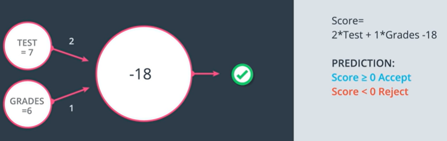

Consider the classifcation problem at hand: Find if a student will be accepted to university or not

The boundary line above indicates the point where score is 0. 

## Perceptron

Its the building block of neural networks and its just an encoding of our equation into a small graph.
The way we have built is the following:
1. We will fit the data and the boundary line inside a node.
2. Now we add 2 nodes for the input - in this case which are: `Test = 7` and `Grades = 6`
3. And what the perceptron does is that it plots the point (7,6) and checks if the point is in +ve or -ve area.
4. If the point (7,6) is in +ve area it return __Yes__ otherwise it returns a __No__.

Our prediction consists of:  
- Accept: `score >= 0`
- reject: `score < 0`

Now recall our equation `2*Test + 1*Grades - 18`.  
2, 1 and -18 are what define a linear equation so we will use them as labels in the graph.

2 and 1 will labels edges coming from x1 and x2 respectively and bias label -18 will label the node. Thus when we see a node with these labels we can think of the linear equation they generate. 

Another way to generate this node is to consider the bias as part of the input. As we have input values for Test and Grades. Lets take 1 as input value for bias and hence try to make the equation with -18 as its weight.

We will be using both but the 2nd one is more often used.  

Creating a genral equation for the above perceptron

Note we are using an implicit function called the __step function__. 

So in reality the perceptrons can be seen as a combination of nodes where the
- First node calculates the linear equation of the inputs on the weights
- Second node calculates the step functions to the result.

This can be generalized as follows:
- Summation sign represents a linear function in the first node.
- And the 2nd node represents the step function

Generalizing the 2 perceptron models we learnt above:

***

## Why these are called __Neural networks__?

Because the perceptrons look like neural networks in the brain. We will be mimicking the neural network by taking output from one and turning it into the input of another.

***

