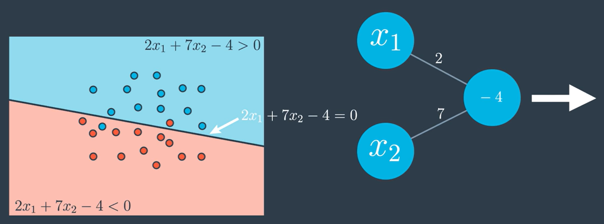

 # Continuos Perceptron

 Recall if we have data as shown below and with linear model with equation $2x_1 + 7x_2 - 4 = 0$ this will give rise to a probability function that looks like this. The points in blue region will have more chances of being blue and points in red region have more chances of being red. And this will give a perceptron where we will label the edges by the weights and the node by the bias.

 

***

