# Neural network architecture

 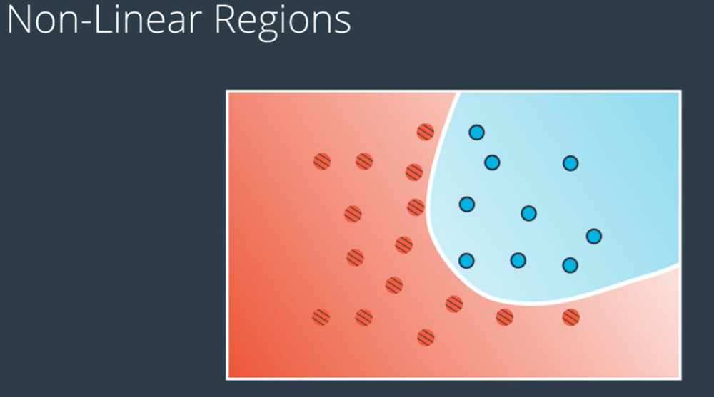

Create a probability function to seperate the two regions. And the curve which seperates the two regions, is made up of points which are equally likely to be blue or red.

Everything will be same as before except the equation will not be linear.

## __How to create non-linear models?__

This first two chapters will show us how to combine two perceptrons into a third, more complicated one.

## [Video 1](https://youtu.be/Boy3zHVrWB4)

We will be combining two linear models into a non-linear model. 

 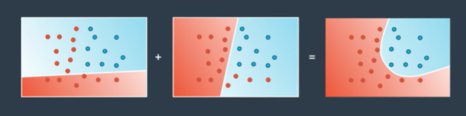

 A linear model is a whole probability space. This means that for every point it gives the probability of that point being blue.

 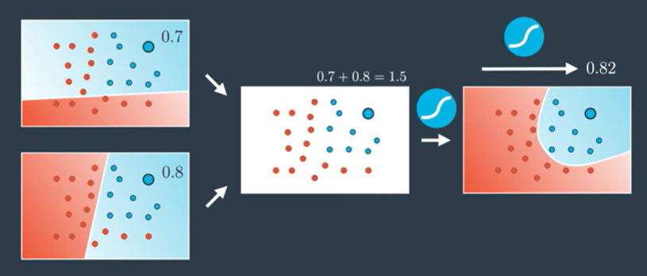

 As observed above the same point have two probabilities of 0.8 and 0.7 for the two linear model used to seperate the two regions. 

 We can simply combine the 2 numbers or add their probabilities and get 1.5. And as we know, we need a number between 0 and 1 for probability. We can use the sigmoid function whoch can convert any number to that between 0 and 1. On applying sigmoid function to 1.5 we get a value of 0.82 and thats the probability of this point in the resulting probability space.

__What if we wanted to assign different weights to the two models used to create the resultant probability function?__

Lets say we wanted to assign more weights to the 1st model.

 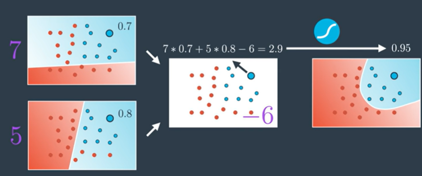

So the curved model is the linear combination of the weighted models with the bias.

## [Video 2](https://youtu.be/FWN3Sw5fFoM)

So above you learnt you can add two models to obtain a third model.  We saw linear combination of the weighted models with the bias gives us a non-linear model.

Lets consider two linear models represented by $5x_1-2x_2+8$ and $7x_1-3x_2-1$. Also see their respective perceptrons.

 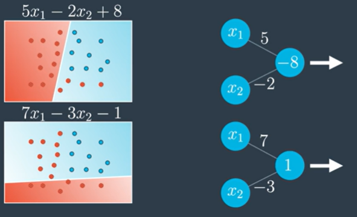

 Lets use another perceptron to combine these 2 models using the linear equation $7m_1 + 5m_2 - 6$.

 where,   
$m_1$ - Model 1   
$m_2$ - Model 2  

 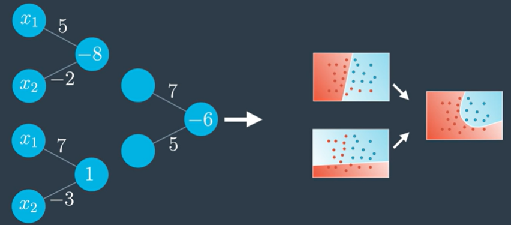

Observe when we join the perceptrons to get a neural network as below:

 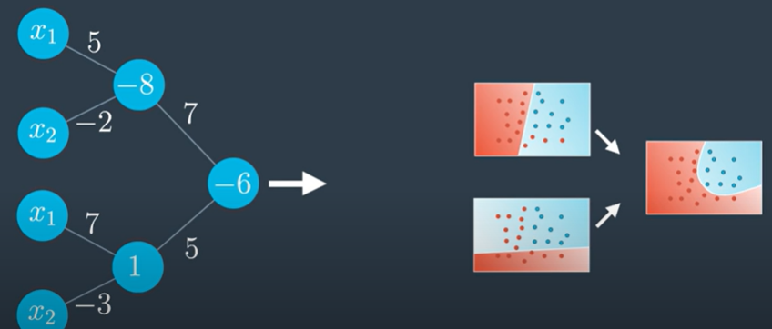

We can clean it up a bit and get the following:

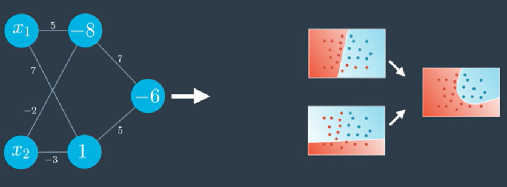

The above neural network can also be defined by defining the bias as a seperate node. The neural netwok shows the sigmoid activation function on the perceptron.

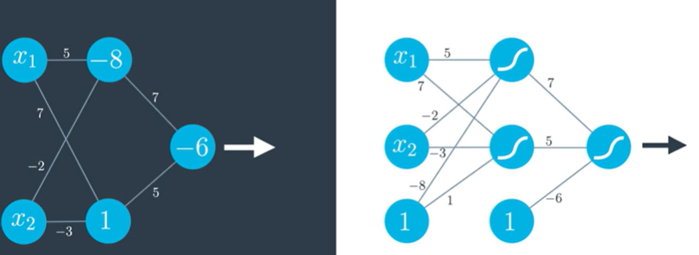

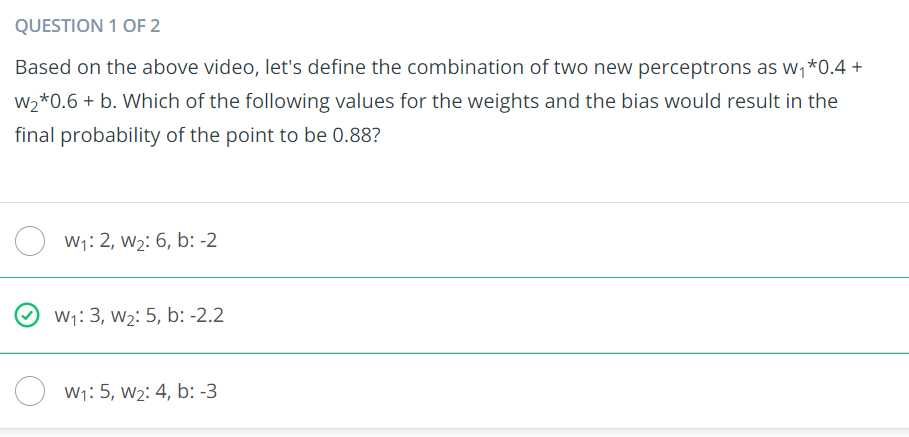

### Multiple layers

Now, not all neural networks look like the one above. They can be way more complicated! In particular, we can do the following things:

- Add more nodes to the input, hidden, and output layers.
- Add more layers.

We'll see the effects of these changes in the next video.

### [Video 3](https://youtu.be/pg99FkXYK0M)

Neural networks have a special architecture with the layers. 
- __Input layers__: It has the inputs.
- __Hidden layer__: Its the set of linear model created with the inputs from the first layer. 
- __Output layer__: Its here the linear models get combined to create the non-linear model.

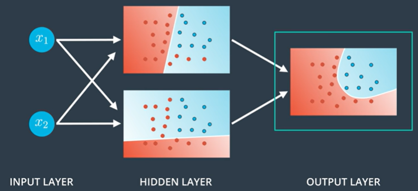

We can have different architectures such as combining 3 linear models to get the triangular boundary in the output layer.

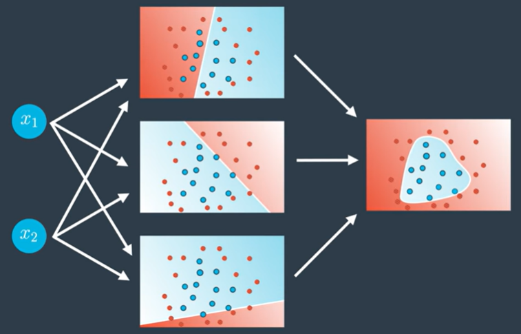

Now what if the input layer has three nodes (i.e, we are dealing with 3-dimension problems now). Now the hidden layer (having linear models) will give us a bunch of planes in 3D space and the output layer wll bound a non-linear region in three space.

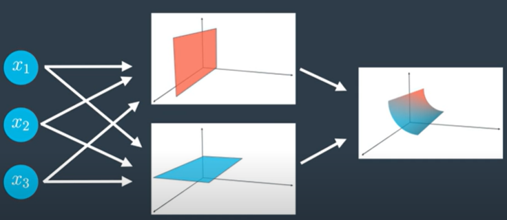

In general if we have n-nodes in the input layer then we are thinking of data in n-dimensional space.

__Now what if our output layer has more nodes, then we have more outputs. And in that case we have multi-class classification model__

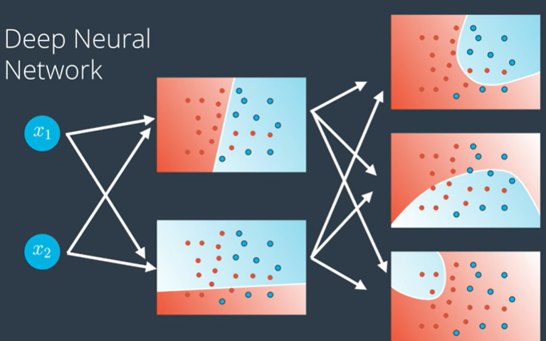

So if our model is telling us if an image is a cat or a dog or a bird, then we simply have each node in the output layer output a score for each one of the classes: one for the cat, one for the dog and one for the bird.

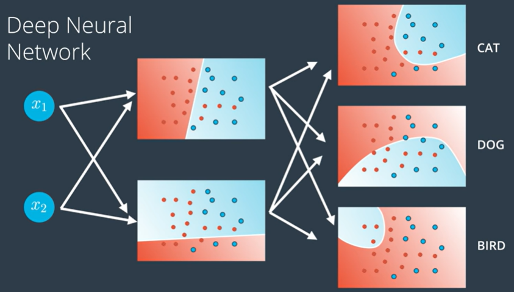

__Now what if we have more layers? Then we have what is called a Deep neural network.__

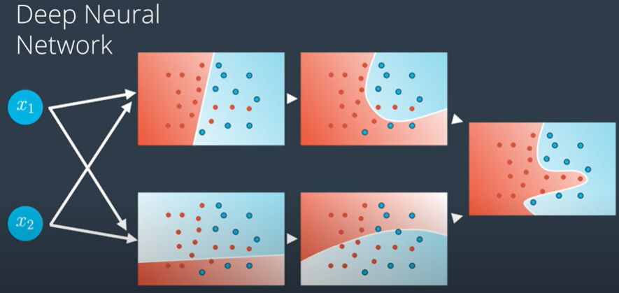

What happens here is our linear models combine to create a non-linear model and these non-linear models combine to create even more non-linear models.

In general we can combine them many times and can obtain highly complex model with lots of hidden layers. This is where the magic of neural network happens. Many of the models for self-driving cars, games, etc have many-many hidden layers. That neural network will split the n-dimensional space with highly non-linear boundary as shown in image below. 

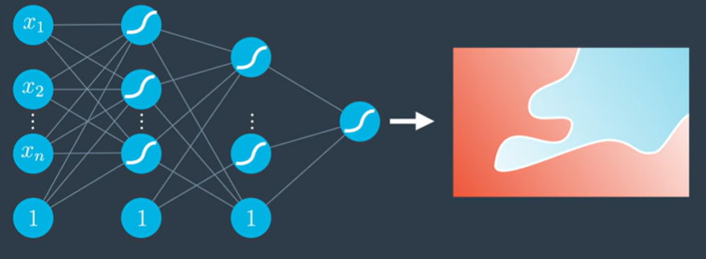

### Multi-Class Classification
And here we elaborate a bit more into what can be done if our neural network needs to model data with more than one output.

### [Video 4](https://youtu.be/uNTtvxwfox0)

It may seem that the neural network works really well when the problem consists of classifying two classes with the aid of a simple neural network below. For example if the model predicts a probability of receiving a gift or not - then the answer just comes out as the output of neural network.

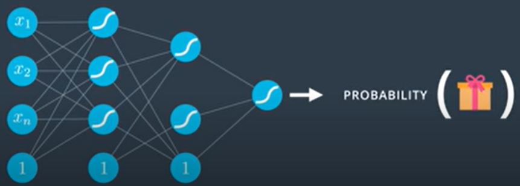

But what happens if we have more classes? Say we want the model to tell us if the image is that of a duck, a beaver or a walrus.

__Case 1:__

We can create an individual neural network for each of the classes and can then use the softmax or pick the answer that gives us the highest probability. But the method below is overkill (or tiresome).

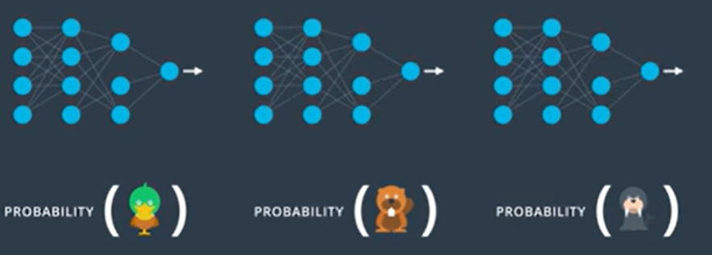

__Case 2:__

The first layer of the neural netwok must be enought to tell us details about the image  and may be the last layer must be enough to tell us which animal it is.

As a matter of fact we will be doing the same thing using CNN (Convolutional neural network). And each one of the nodes must be enough to tell us I.e, give us the probability that the image belongs to this animal.

Now we can use the score and the softmax function which was previously defined to obtain the well defined probabilities. This is how we can use neural networks for __multi-class classification__.

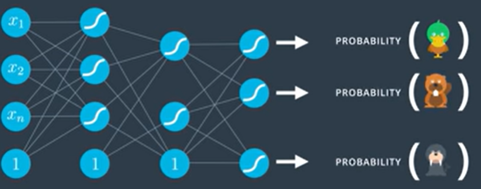

***

#### Quiz

__How many nodes in the output layer would you require if you were trying to classify all the letters in the English alphabet?__

Ans:  
To classify 26 letters you will need 26 nodes in the output layer. (Alternatively, 52 nodes for 26 uppercase and 26 lowercase letters)