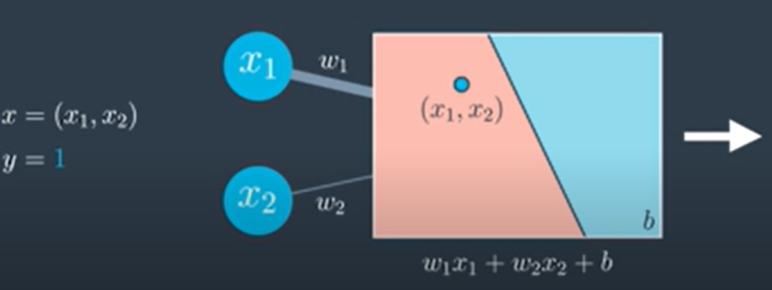

# Feedforward
Feedforward is the process neural networks use to turn the input into an output. Let's study it more carefully, before we dive into how to train the networks.

### [Video 1](https://youtu.be/hVCuvMGOfyY)

Now that we have defined what neural networks are we need to know how to train them. Training them means what parameters they must have on the edges in order to model our data well. And we need to understand how to process the input to obtain the output. 

So lets look at our simplest neural network - a perceptron.

The perceptron receives a data point $x = (x_1, x_2)$ where the label is $y = 1$. This means that the point is blue. 
The perceptron is defined by a linear equation $w_1x_1 + w_2x_2 + b$.  $w_1$ and $w_2$ are the weights in the edges and B is the bias in the node.

Here $w_1$ is bigger than $w_2$ so we can denote that by drawing edge of $w_1$. The perceptron plots the point $(x_1, x_2)$ and it outputs the probability that the point is blue. In the figure below, as the point is in the red area so the probability is low and the output is a slow number. This process is known as __feed-forward__.

 

We can see that the model above is a bad-model as the point is blue and its not correctly classified. And the third coordinate $y=1$.

Similar model can also be found for the non-linear model. The 2 layers are combined to give a non-linear model.

__In the image below__, we have the neural network in other notation so the bias is in the outside. And the biases have been written as $W_{31}$ and $W_{32}$. Then we apply the sigmoid function to turn the outputs from the 1st layer into values between 0 and 1.

So the above transformations can be written as:

$$ \sigma\begin{bmatrix}W_{11}^{(1)} & W_{12}^{(1)} \\W_{21}^{(1)} & W_{22}^{(1)} \\W_{31}^{(1)} & W_{32}^{(1)} \end{bmatrix}\left(\begin{array}{c}x_1\\ x_2 \\ 1\end{array}\right) $$

Then the vector format of these values will get 1 attached for the bias unit and multiplied by the second matrix. This returns an output that gets inputted to a sigmoid function to give an output function $\hat{y}$. $\hat{y}$ is a prediction that the point labelled is blue.

We can apply this again on a multi-layer perceptron or neural network. 

***

## Error Function
Just as before, neural networks will produce an error function, which at the end, is what we'll be minimizing. The following video shows the error function for a neural network.

### [Video 2](https://youtu.be/SC1wEW7TtKs)

For a single layer perceptron:

Error function gives a measure of how badly each point is classified or a measure of how far is the point from the line.

For a multilayer perceptron:  
We will be using the same formula except the $\hat{y}$ is a bit more complicated.

***

