# Backpropagation

Now, we're ready to get our hands into training a neural network. For this, we'll use the method known as __backpropagation__. In a nutshell, backpropagation will consist of:

- Doing a feedforward operation.
- Comparing the output of the model with the desired output.
- Calculating the error.
- Running the feedforward operation backwards (backpropagation) to spread the error to each of the weights.
- Use this to update the weights, and get a better model.
- Continue this until we have a model that is good.

Sounds more complicated than what it actually is. Let's take a look in the next few videos. The first video will show us a conceptual interpretation of what backpropagation is.

## [Video 1](https://youtu.be/1SmY3TZTyUk)

In feed-forward we check the point and return the probability whether the point is blue or not.  

 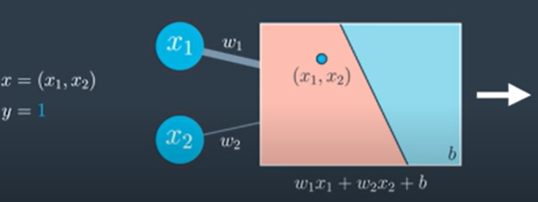

 Now remember in gradient descent for a sing;e-layer perceptron, its like we ask the point what it wants to do. In this case, the point is misclassified and it would want the model line to be as close as possible to approcah the blue region. And we saw that the line got closer to the points by updating the weights. 

  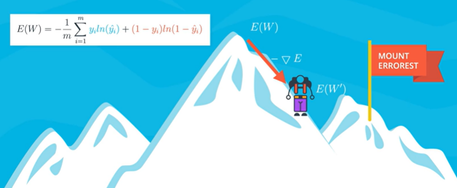

  For __multi-layer perceptron__, now its more complicated. 

 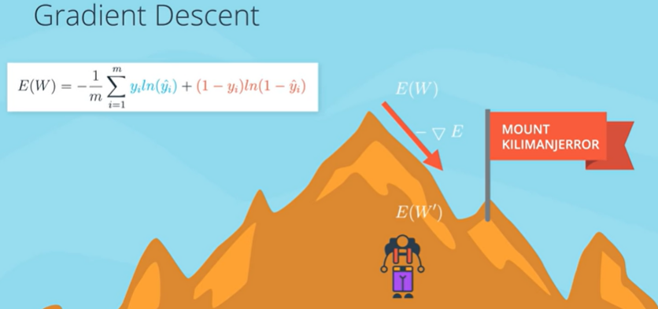

 In feed-forward we found the probability of point based on the position in the non-linear model.

 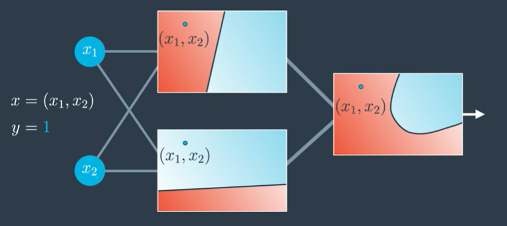

 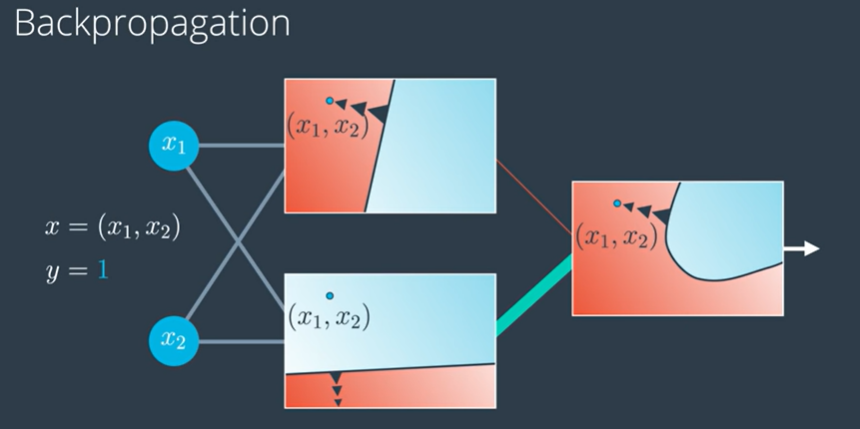

 We can ask the point which is misclassified to what you want the model to do such that its better classified: it will want the seperating curve to be closer to it or the blue region to be closer to it. So we can look at the two models and we can observe that the model 2 is classifying the model correctly aas compared to model 1. So we can decrease the weight coming from the top model and increase the weight from bottom model (model 2). So our final/resultant model will look more like the bottom model as compared to the top model.

 Or we can go to the 2 linear models and ask them what can the linear models do to classify it better. And the top model will want the seperating line to be closer to the point. And the bottom model will say as its correctly classified it will like to remain in the blue region and the seperating line to be as far as possible from it. And this change in the model will have a change in the resultant model.

__In the resultant model above, we have left out the bias for more clarity or ease of understanding.__

## Backpropagation Math
And the next few videos will go deeper into the math. 

Feel free to tune out, since this part gets handled by Keras pretty well. If you'd like to go start training networks right away, go to the next section. But if you enjoy calculating lots of derivatives, let's dive in!

__Error function is avergae of all the points where the blue term is for blue points and the red term is for the red point.__

__To descend from the Mount everest :) or to reduce the error function we will calculate the gradient of the error function.__ And the gradient is simply the vector formed by all the partial derivatives of the error function with respect to weights $w_1$, ..$w_n$ and the bias $b_1$. The partial derivatives will correspond to the edges highlighted in fig below.

 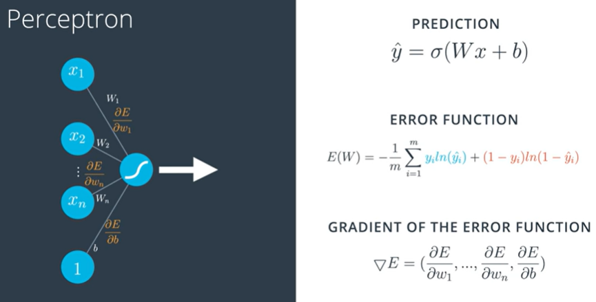

For multi-layer perceptron, we will have the following:

 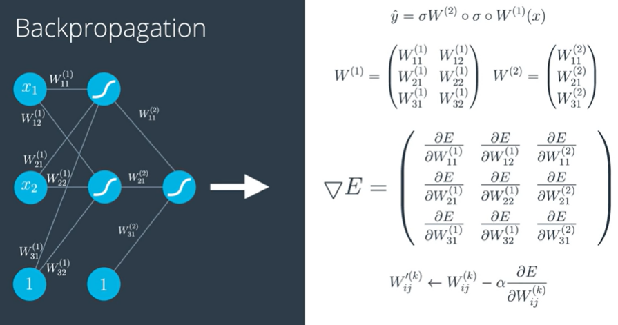

## Chain Rule

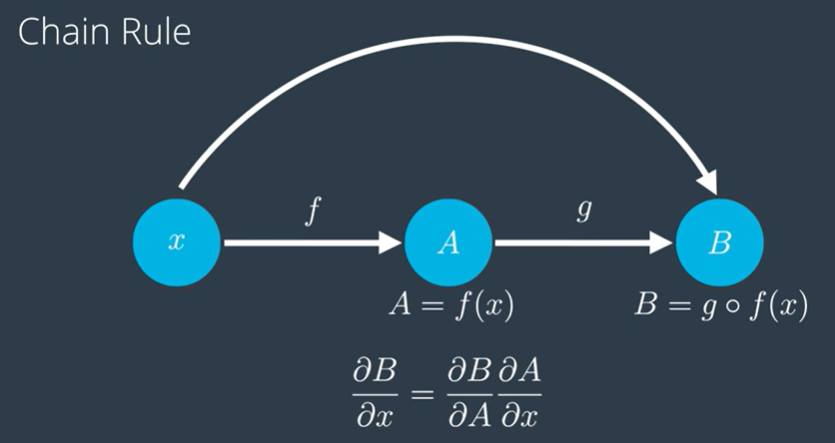

So from the chain rule we can understand:  When composing functions the derivatives just multiply. This is important to us feed forwarding is literally composing a bunch of functions and back propagation is literally taking the derivative at each piece and since taking the derivative of each composition is the same as multiplying the partial derivatives, then all we gona do is multiply a bunch of partial derivatives to get what we want.

***

#### Consider feed-forward:

Lets go back to our neural network with our weights and our input. And recall that weights with $W^1$ belongs to first layer and weights with $W^2$ belongs to the second layer. And also we will be calling bias as $W^{(2)}_{31}$ to make everyhting in matrix notation.

$W^{(1)}$ and $W^{(2)}$ are the weight matrices of layers 1 and 2.

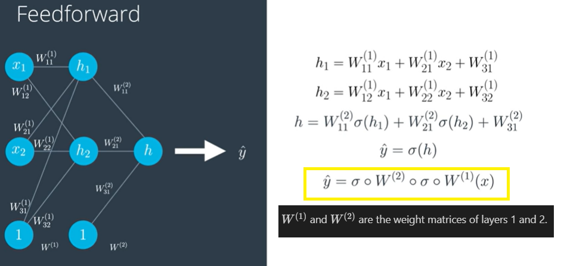

#### Consider back propagation

__Back-propagation__ is exactly the reverse of feed forward.

So will be caluclating the derivatives of the error function with respect to each of the weights in the labels by using the chain rule.

Recall our error function is a function of prediction $\hat{y}$. But since the prediction is the function of all weights $w_{ij}$ then the error function can be seen as the function on all $w_{ij}$. Therefore the gradient is simply the vector formed by all the partial derivatives of the error function E w.r.t each of the weights. 

Lets calculate the derivative of E w.r.t $W_{11}^{(1)}$.

We can see that the prediction is simply a composition of functions and by the chain rule, we know that the derivative w.r.t this is the product of all partial derivatives. 

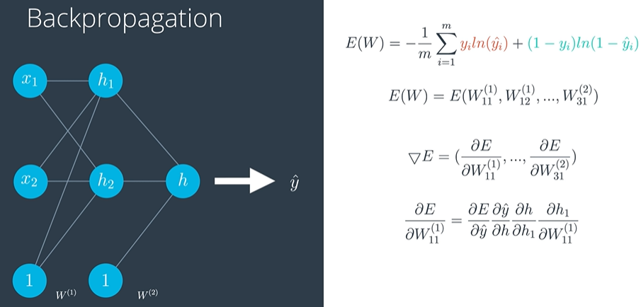

Lets look at just 1 piece of our multi-layer perceptron. The input are values $h_1$ and $h_2$ which are values coming from the previous layer. And once we apply the sigmoid and a linear function on $h_1$ and $h_2$ and a 1 corresponding to the bias unit => we get result h.

__What is derivative of h w.r.t to $h_1$?__  
h is a sum of three things and only one contains $h_1$ so the other 2 will become zero. 

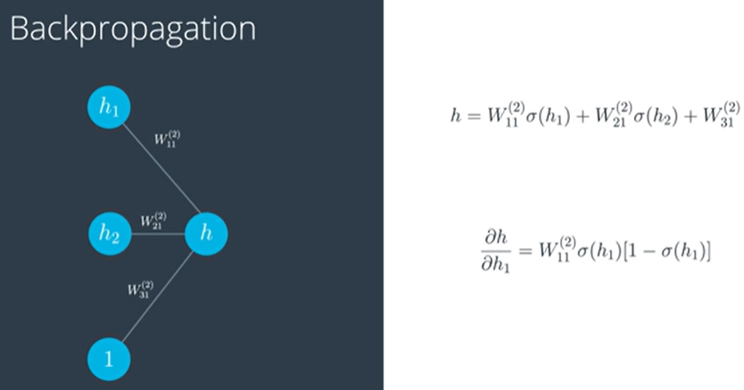

And in this way we train a neural network.

__PFB the derivative of sigmoid function:__

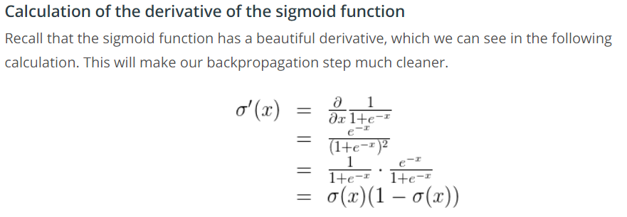

