## Maximum Likelihood

Student with 2 models giving probability of acceptance as: __Model A - 80% and Model B - 55%__. So __best model is the one that gives the probability of the event that happens to us.__ So if we get selected Model A will be better and if student did not get accepted then we can say that the more accurate model is Model B.

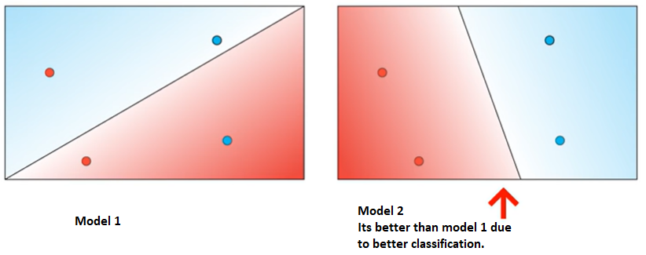

Lets see why Model 2 is better from the probability perspective (i.e, why model 2 is more likely to happen than model 1). 

P(red) = 1 - P(blue)

Need to find the probability of the 4 points being of the color that they themselves are.

#### Model 1  

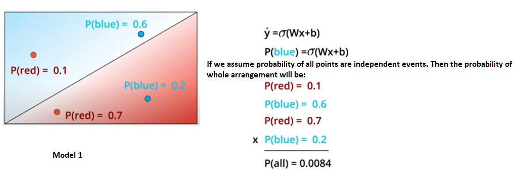

#### comparing __Model 1__ and __Model 2__.

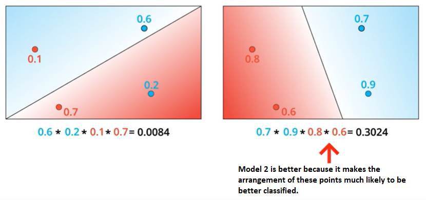

So our goal is to maximize the probability such that we get probability of Model 2.

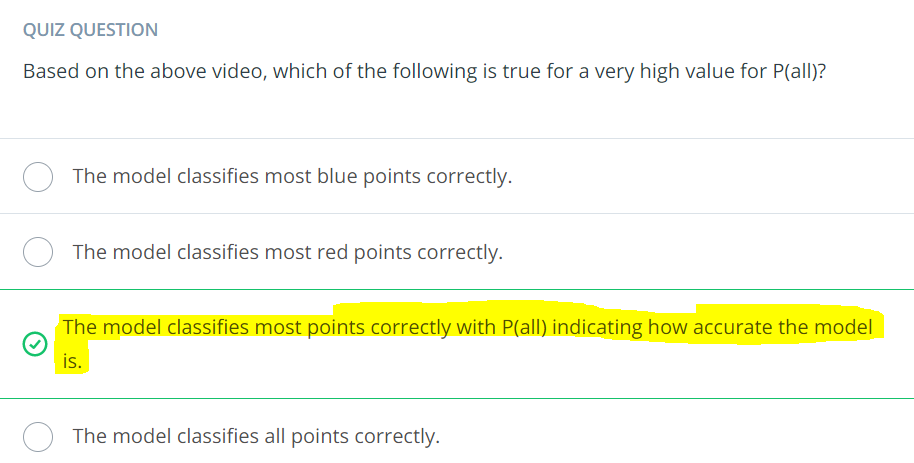

## Maximizing Probabilities

Maximizing the probability __is equivalent to__ minimizing the error function.

So to compare the 2 models we need to find P(all) and it is the product of differnt points whether they are classified correctly or not. 

But it would be better to stay away from products as the product of multiple numbers (say in 1000s) would be a very small decimal number say almost 0.00000...x.  So instead of doing products we can go for the easier alternative which is sum. 

We can use `log()` to convert products to sum.

```
log(ab) = log(a) + log(b)
```


Important points to remember:
- Logarithm of a number between 0 and 1 is always negative.
- Logarithm of 1 is always zero.

## Cross-entropy

To avoid negative number in our results we will be taking __negative of the probabilities and then we will sum them up.__ This sum of the negative probabilities is known as __Cross-entropy__.

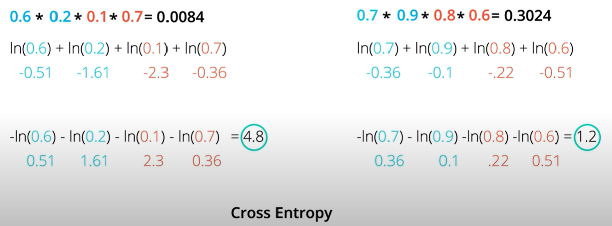

On calculating the entropies, we  observe the bad model has a high cross-entropy of 4.8. But good model has a lower cross-entropy of 1.2.

> A good model will give us a low cross-entropy and a bad model will give us a high cross-entropy.

__Reason is simply that a good model will give us a high probability and the negative of the logarithm of a large number is a small number and vice-versa.__

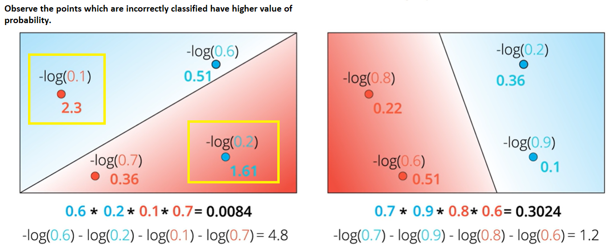

__So now our goal has changed from maximizing the probability to minimzing the cross entropy. And the error function which we needed is the cross-entropy.__

So we're getting somewhere, there's definitely a connection between probabilities and error functions, and it's called __Cross-Entropy__. This concept is tremendously popular in many fields, including Machine Learning. Let's dive more into the formula, and actually code it!

__Cross-entropy__ says the following - __if i have a bunch of events and a bunch of probabilities how likely is that those evemts happen based on the probabilities. If its very likely we have a small cross-entropy. If its very unlikely then we have a large cross-entropy.__

Example:

Assume these events are independent. We need to find the most likely scenario here. Here the most likely probability is obtained by picking the largest value in each column.

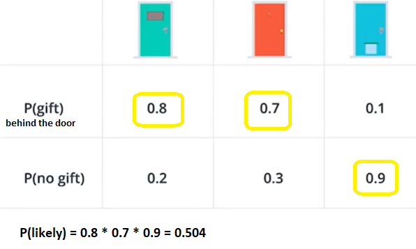


Lets look at the different scenarios here:

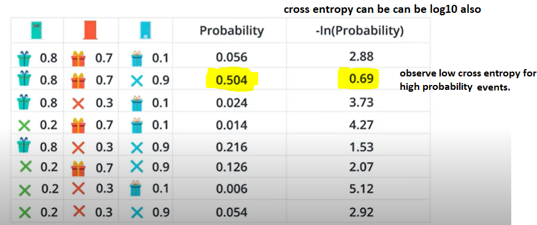

Lets calculate a formula for cross-entropy: we will be taking the scenario with the highest probability (i.e lowest cross-entropy, i.e, the one which is most likely).

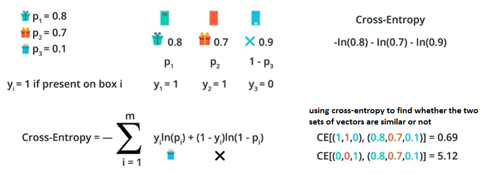

So cross-entropy tells us when 2 vectors are similar or different.

`CE[(1,1,0),(0.8,0.7,0.1)] = 0.69`

1st vector tells us about $y_i$ for the three doors so `(1,1,0)` represents there is a gift behind the 1st and 2nd door and no gift behind the last door. So arrangement of gifts given by `(1,1,0)` is very lkely to happen based on the probabilities given by the 2nd set of numbers `(0.8,0.7,0.1)`. And the low value of cross-entory confims that both are similar.

For case:

`CE[(0,0,1),(0.8,0.7,0.1)] = 5.12`

Similarly if $y_i$ is `(0,0,1)` and the probabilities are `(0.8,0.7,0.1)` then there is no similarity as behind the 1st 2 doors there are no gifts and there is gift behnd the 3rd and the probabilities represent exactly the opposit so there is no similarity between the two.

__Code entropy code__

```
import numpy as np

def cross_entropy(Y, P):
    Y = np.float_(Y)
    P = np.float_(P)
    return -np.sum(Y * np.log(P) + (1 - Y) * np.log(1 - P))
```
Trying for Y=[1,0,1,1] and P=[0.4,0.6,0.1,0.5].  
The correct answer is  
4.8283137373

## [Multi-Class Cross Entropy](https://youtu.be/keDswcqkees)

Above example is comparable to two classes: class with gift and class without gift. But what about cases where we have more than 2 classes.

Case were we can have any of the 3 animals behind the door.

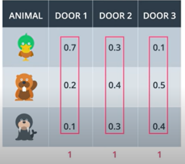

Observe the numbers in the columns must add to 1.

Calculating the general equation for the multi-cross entropy:

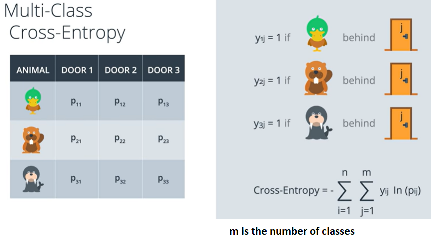

Try sample exercise asked in the end of the video.
***

> cross-entropy is inversely proportional to the total probability of an outcome.

***
