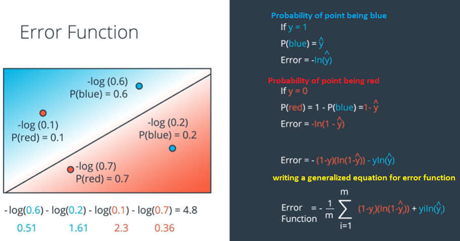
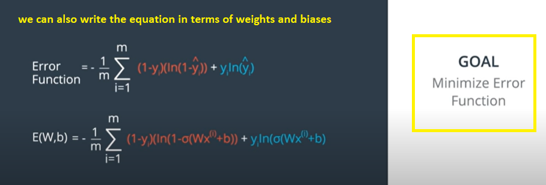

# Logistic Regression

Trying to implement the classification model using logistic regression.

m - is the total number of points.   
We have used averaging (i.e, divinding by m) in the generalized equation above following the general convention.

So when we calculate the error function we will get a large value if the point is misclassified and a small value if the point is correctly classified.

### Minimizing the error function

We will start with random weights which will give the prediction $\sigma(Wx+b)$ and it will also give us an error function.

We will be minimizing the function `E(W,b)`. `E(W,b)` is the height of the mountain and we will be using gradient descent to go down the hill and at the next point we will get a new error function with different set of weights and biases `E(W',b')`. 

