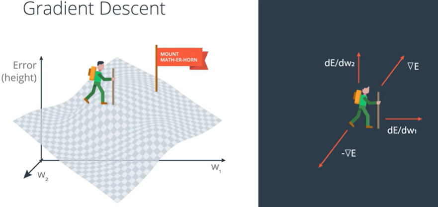
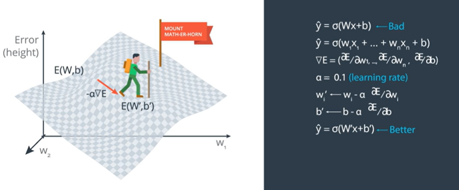
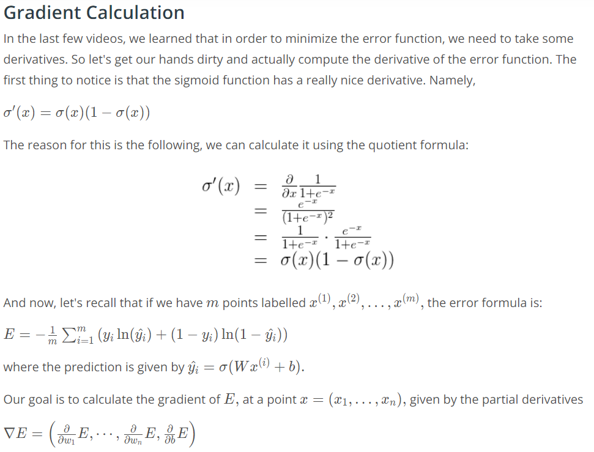
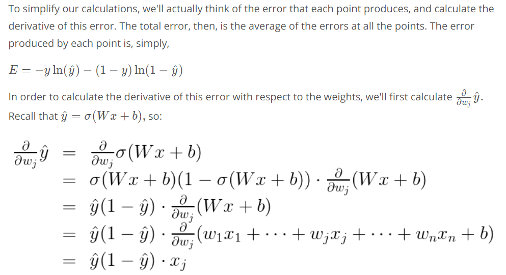
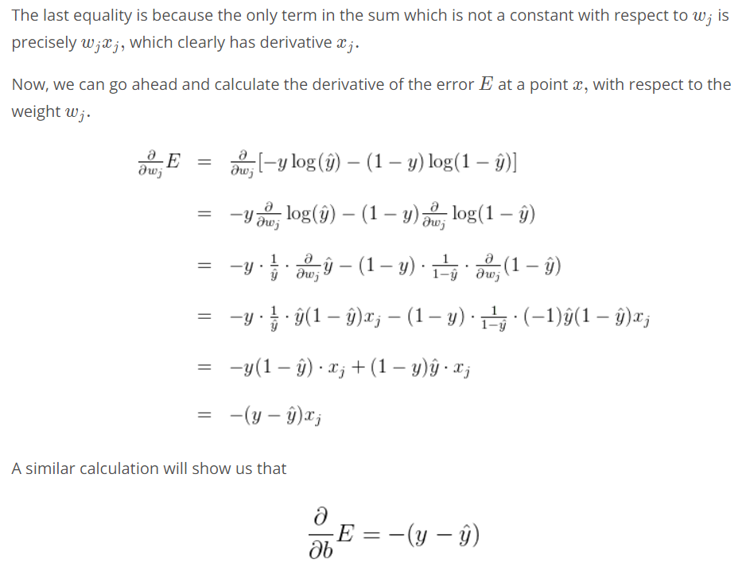
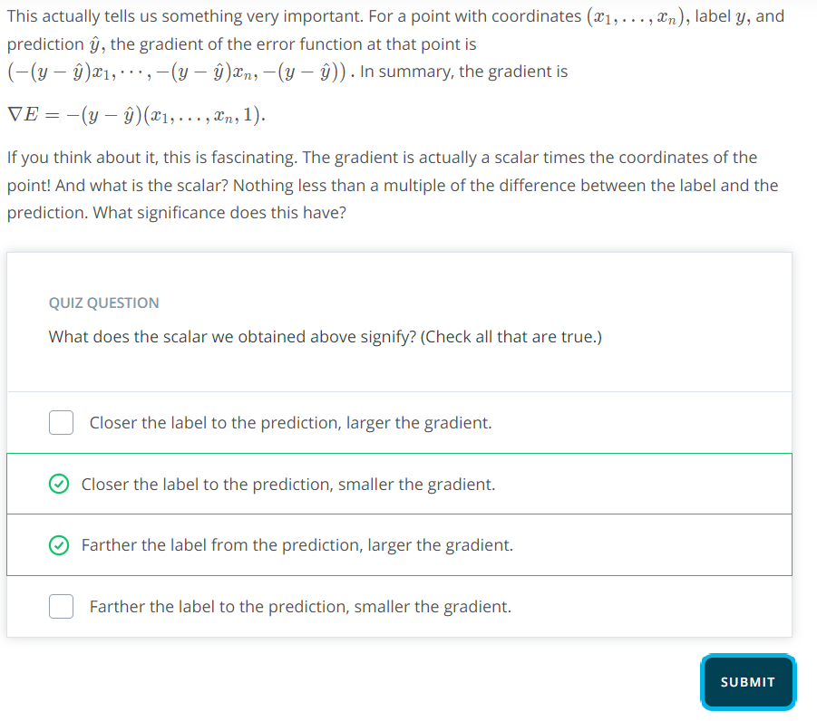
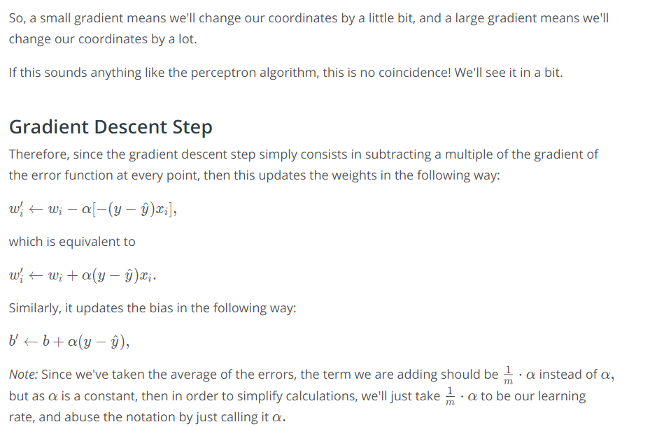
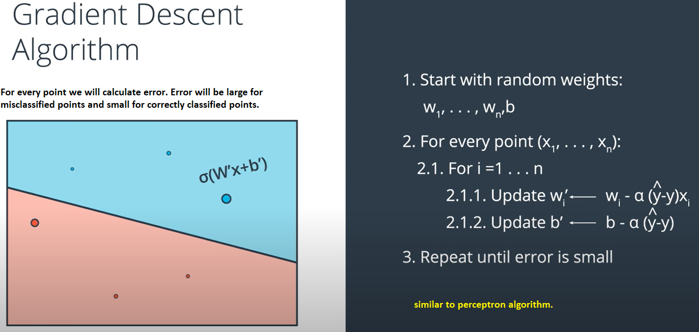

# Gradient Descent

Let the weights be $w_1$ and $w_2$ and the error function is E. And the gradient of E is given by vector sum of partial derivative of $w_1$ and $w_2$. This gradient tells us the direction we want to move if we want to __increase__ the error function the most. Thus __if we take the negative of the gradient this will tell us where to decrease the error function the most__.

Lets say we start with initial prediction $\hat{y}=\sigma(Wx+b)$ and this prediction is bad i.e, we are high up in the mountain so we will descend according to the negative gradient of the error function. Now as we dont want to take drastically large steps we will go with small steps of alpha or learning rate i.e, $\alpha = 0.1$.

This will take us to a predcition with a lower error function and so we can conclude that the new prediction $\acute{y} = \acute{W}x + \acute{b}$ with weight $\acute{W}$ and bias $\acute{b}$ are better than before. This is exactly the __gradient descent__ step.

> If a point is well classified, we will get a small gradient. And if it's poorly classified, the gradient will be quite large.

***

# Writing Psuedo code for gradient descent algorithm - Logistic regression

