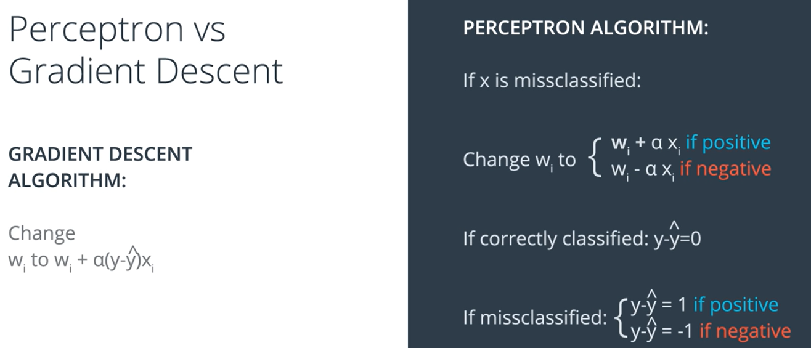
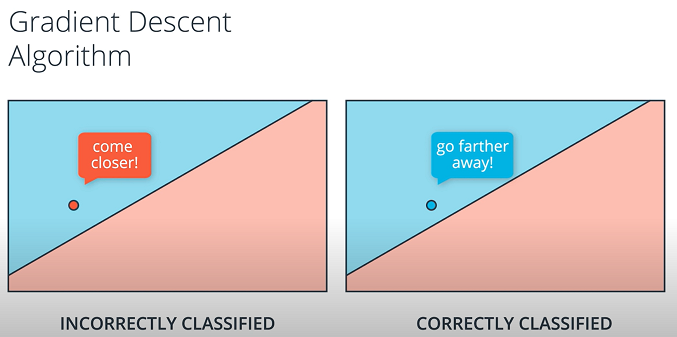

# [Perceptron vs Gradient Descent](https://youtu.be/uL5LuRPivTA)

In gradient descent we take weights and change them from $w_i$ to $w_i + \alpha(y-\hat{y})x_i$.  
In perceptron algorithm not all points changes weights, only the misclassified ones. We change weights $w-i$ by adding or subtracting $w_i$  with $\alpha x_i$ based whether the point label is positive or negative.

## Are these 2 same?

In perceptron algorithms, output is either 1 or 0.

So in gradient descent $y-\hat{y}$ can take any value between 0 and 1. But in perceptron algorithm it can take either 1 or -1.

Both in perceptron algorithm and gradient descent algorithm the point that is misclassified tells the line to come closer because it will eventually want the line to surpass it so that it can be on the correct side.

But if point is correctly classified perceptron algorithm tells the point to do absolutely nothing. But in gradient descent algorithm you are chnaging the weights and the point tells the line to go farther away. So if you are correctly classified you will like to be more into the blue region so that your prediction is closer to 1 and error is lower.

So in gradient descent, misclassified point tells the line to come closer and the correctly classified pint tells the line to move farther away. Line listens to all points an takes steps in such a way that we get as good and convenient solution as possible.

