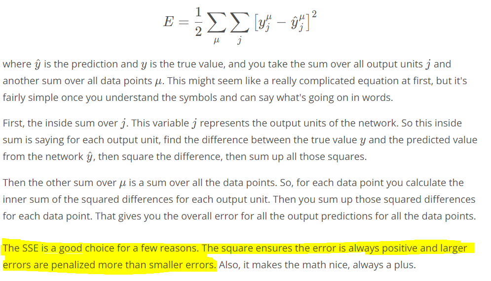
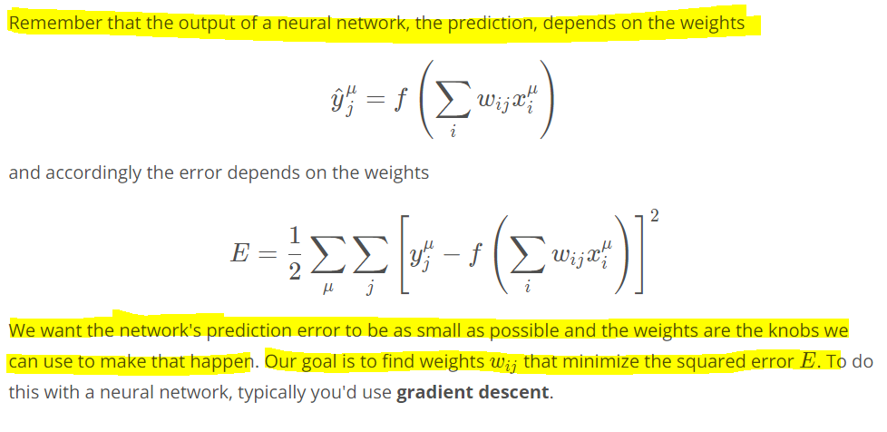
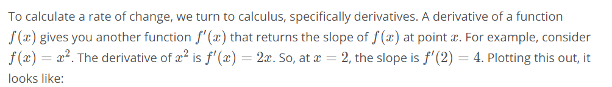
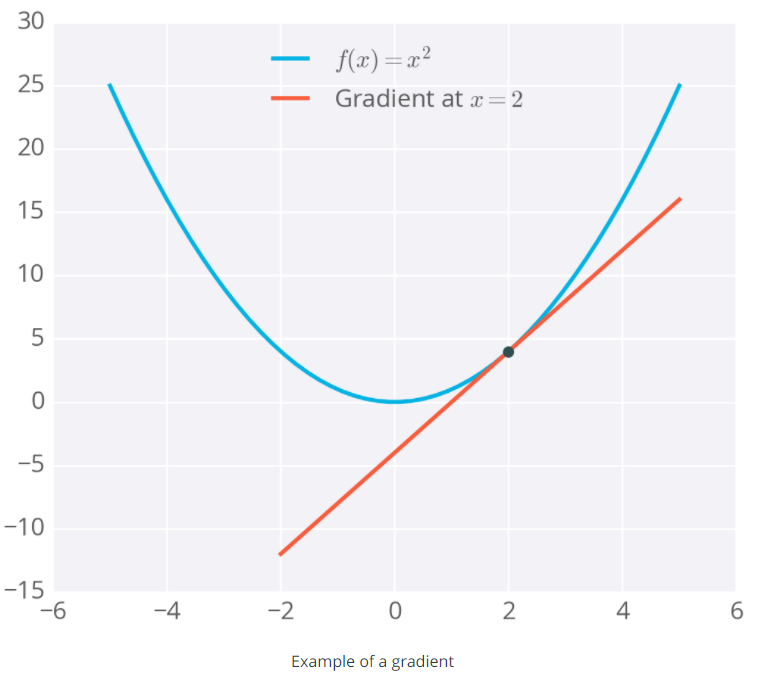
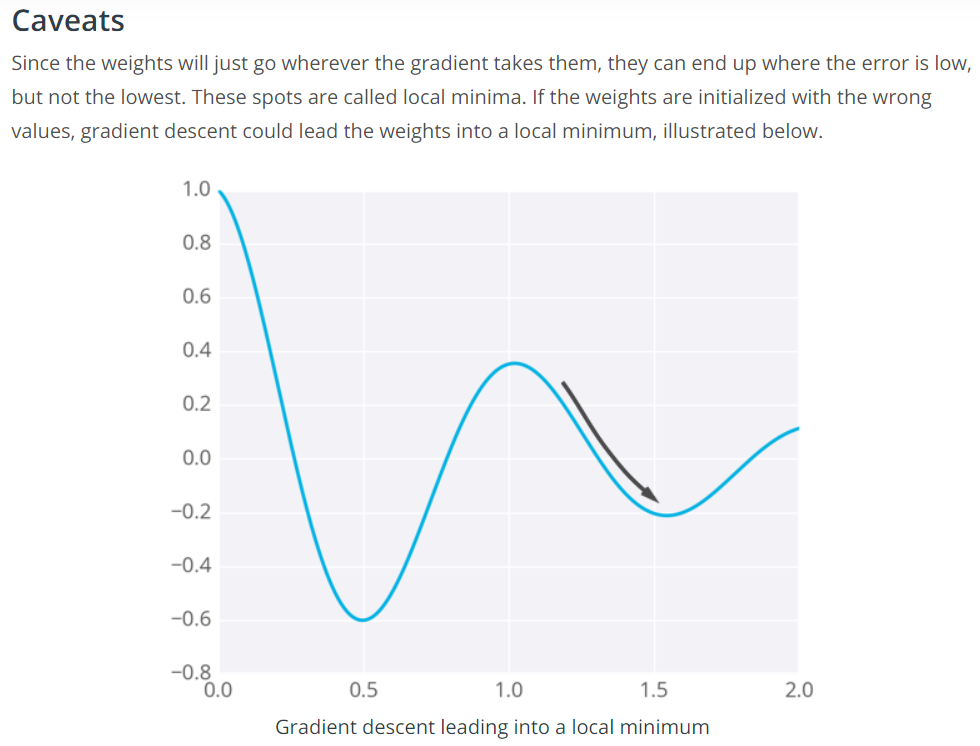

# Gradient Descent

## Gradient Descent with Squared Errors

We want to find the weights for our neural networks. Let's start by thinking about the goal. The network needs to make predictions as close as possible to the real values. To measure this, we use a metric of how wrong the predictions are, the error. A common metric is the sum of the squared errors (SSE):

With gradient descent, we take multiple small steps towards our goal. In this case, we want to change the weights in steps that reduce the error. Continuing the analogy, the error is our mountain and we want to get to the bottom. Since the fastest way down a mountain is in the steepest direction, the steps taken should be in the direction that minimizes the error the most. We can find this direction by calculating the gradient of the squared error.

__Gradient is another term for rate of change or slope. If you need to brush up on this concept, check out Khan Academy's great lectures on the topic.__

The gradient is just a derivative generalized to functions with more than one variable. We can use calculus to find the gradient at any point in our error function, which depends on the input weights. You'll see how the gradient descent step is derived on the next page.

Below I've plotted an example of the error of a neural network with two inputs, and accordingly, two weights. You can read this like a topographical map where points on a contour line have the same error and darker contour lines correspond to larger errors.

At each step, you calculate the error and the gradient, then use those to determine how much to change each weight. Repeating this process will eventually find weights that are close to the minimum of the error function, the black dot in the middle.

There are methods to avoid this, such as using [momentum](https://distill.pub/2017/momentum/).