# Gradient Descent: The Math

Now we know how to get output using a simple neural network, like the one shown below:

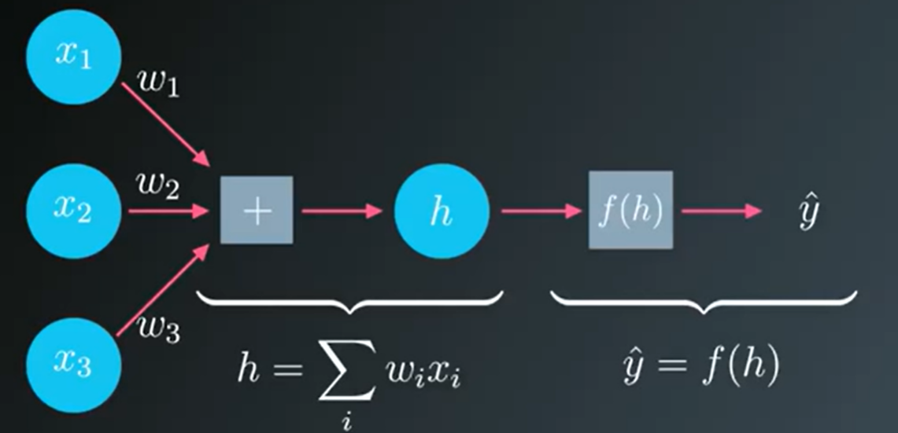

__How do we build this network to make predictions without knowing the correct weights before hand?__ 

What we can do is to present it with data that we know to be true then set the model parameters, the weights to match that data. 

First we need to know how bad our predictions are we can do that using:

$$ E = (y - \hat{y}) $$

To make cases where either y or $\hat{y}$ are low or high both positive we can use square and also using square will penalise the outlier more than when we use absolute or existing difference. Also it will make calculation more easier.

$$ E = (y - \hat{y})^2 $$

But its for only 1 point, we need to sum it up for all points. Also divided by 2 to make calculation easier in future.

$$ E = \frac{1}{2}\sum_{\mu}(y^{\mu} - \hat{y}^{\mu})^2  $$

where $\mu$ represents the data points

The above formulation is called __Sum of squared errors (SSE)__.

Remember $\hat{y}$ is linear combination of weights and inputs passed through activation function. And we can hence see that error depends on weights and inputs. 

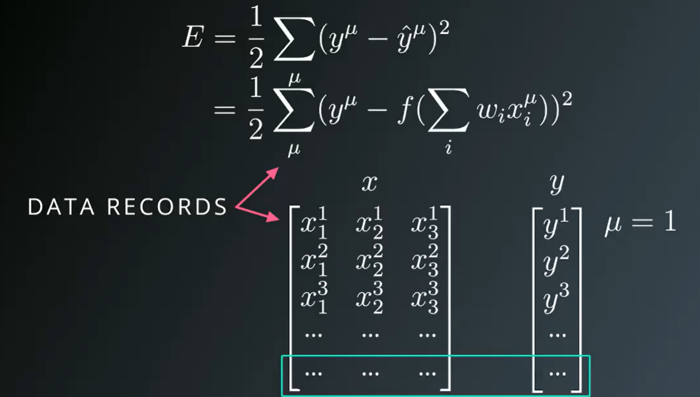

So we scan through all the records and sum up the erros.

SSE is a measure of n/w performance.  
So if SSE is high - n/w is making bad predictions and if its low its making good predictions. So we want to make it as small as possible.

Lets conider a simple example with only 1 data record to make it easier to understand how to minimise the error.

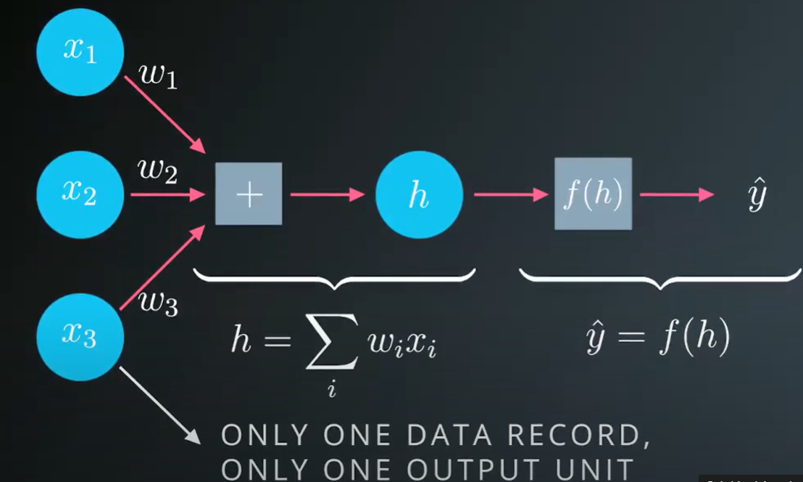

We can see the errors are the function of our weights.

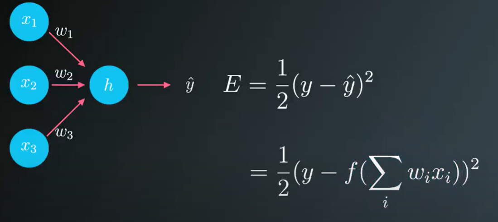

__WEIGHTS LET US TUNE THE NETWORK WHICH IN TURN HELPS US TO REDUCE THE ERROR. OUR GOAL IS TO FIND WEIGHTS THAT MINIMISE ERROR.__

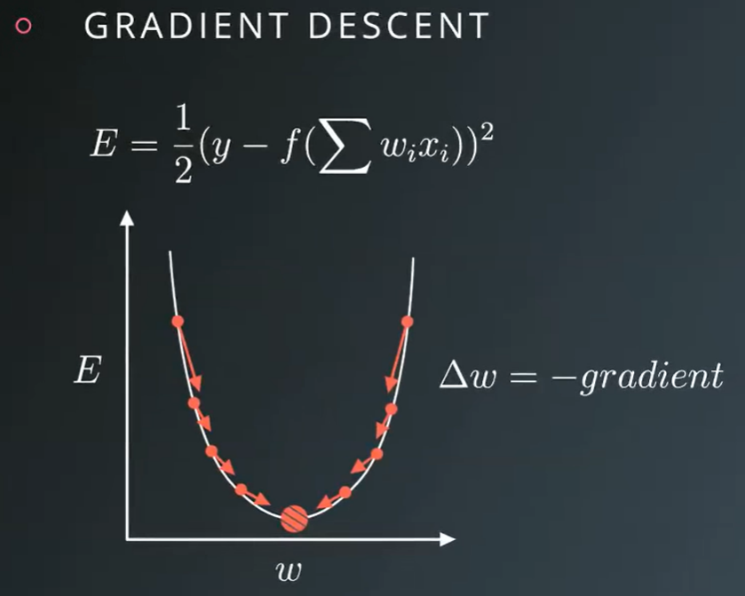

So the updated weights will be:

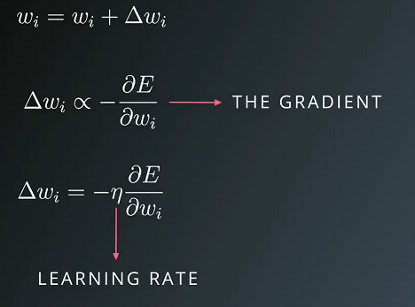

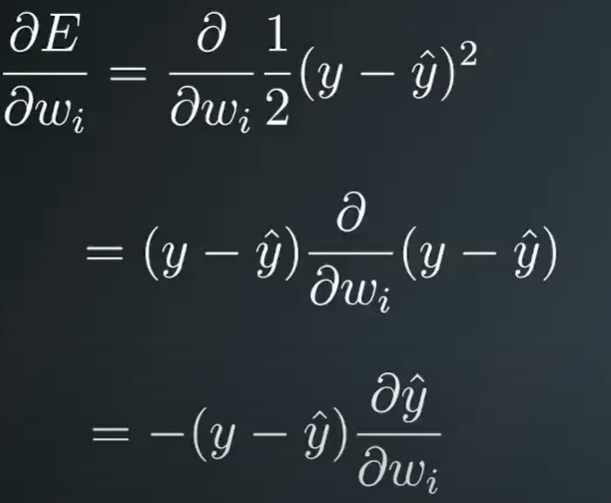

Now $\hat{y}$ depends ont he activation function:

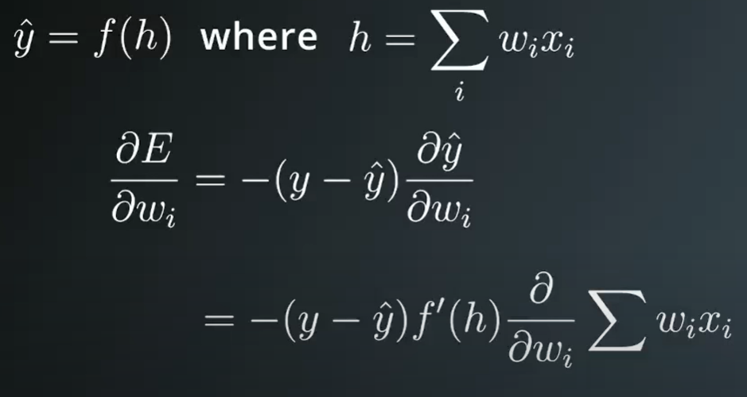

And the derivative of the summation of weights and inputs.

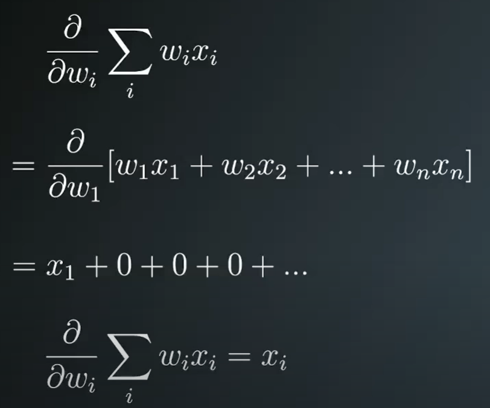

Putting all of them together:

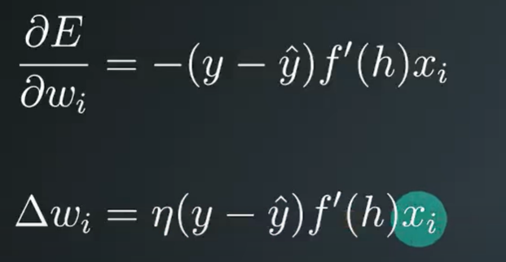

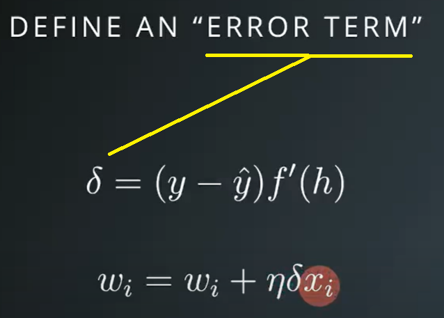

You might be working with multiple output units. You can think of this as just stacking the architecture from single output network but connecting the input units to the new output units. Now the total error would include the error of each outputs sum together. 

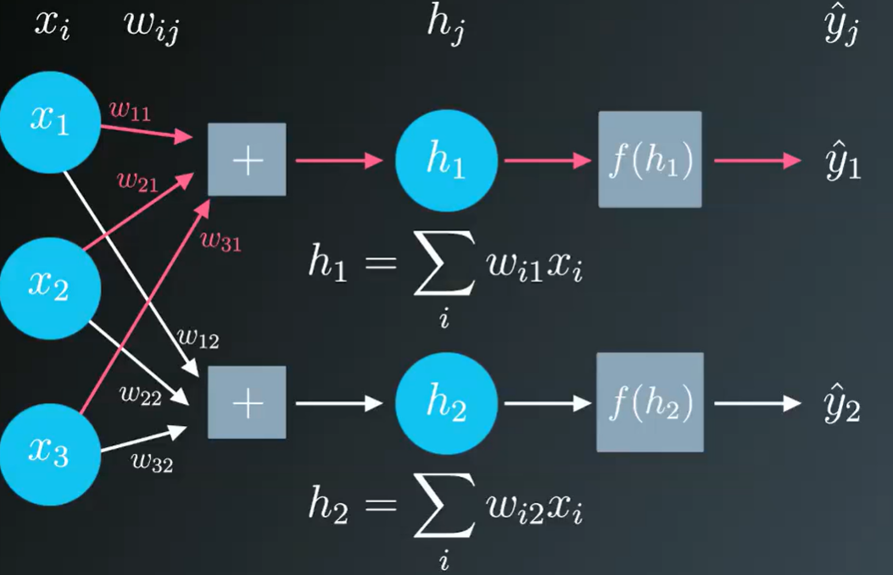

The gradient descend term can be extended to a network with multiple outputs by calculating an error term for each output unit denoted with subscript j.

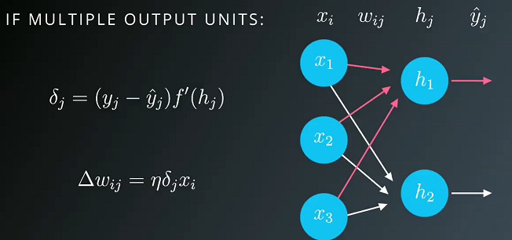

***
