## Perceptron Trick

In the last section you used your logic and your mathematical knowledge to create perceptrons for some of the most common logical operators. In real life, though, we can't be building these perceptrons ourselves. The idea is that we give them the result, and they build themselves. For this, here's a pretty neat trick that will help us.

### How do we find the line that seperates the blue points and the red points in the best possible way?

We need to find the best split line based on the misclassified point. 


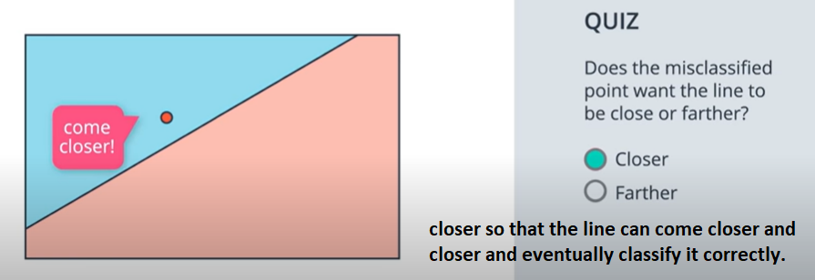

Now that we've learned that the points that are misclassified, want the line to move closer to them, let's do some math. The following video shows a mathematical trick that modifies the equation of the line, so that it comes closer to a particular point.

We will use 4 and 5 (from the point) and use them to modify the equation of the line to move closer to the point. We also use a bias of 1 unit. We will use the resultant values (4,5,1) and subtract them with the lines values (3,4,-10). The new line will have parametrs (-1,-1,-11).

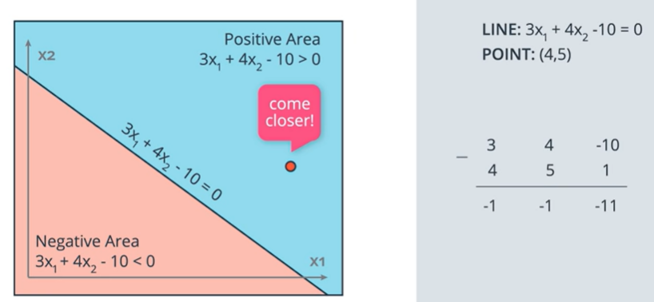

This new line $-1x_1 - x_2 - 11 = 0$ will move drastically towards the point (4,5) but there is a huge risk of wrongly classifying the existing correctly classified points. We want our line to make small steps towards the point for that we will use the parameter __learning rate__.

__Learning rate__ is a small number (say 0.1) and multiply it to the values (4,5,1) and calculate a new line which takes small steps towards the point (4,5).

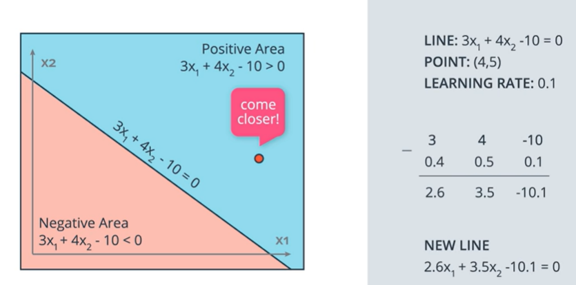

***

## Perceptron Algorithm

And now, with the perceptron trick in our hands, we can fully develop the perceptron algorithm!

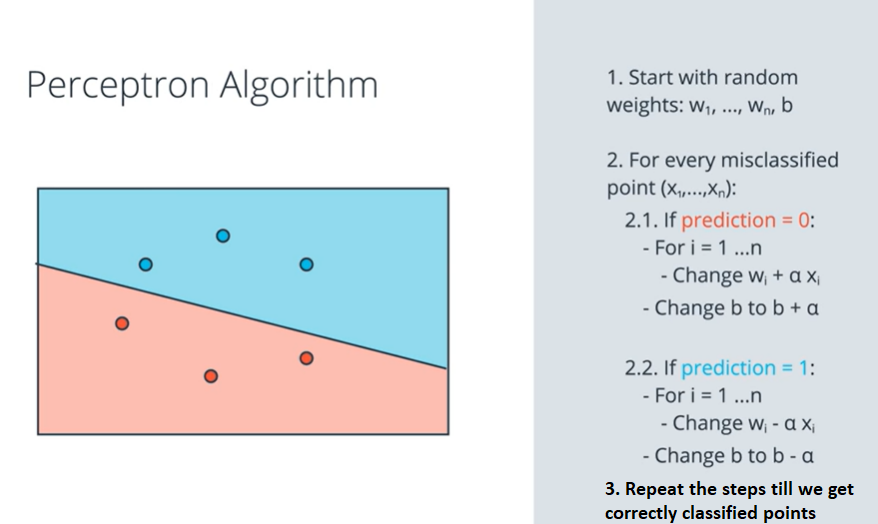

## Non-linear region

In the cases where the regions need to be seperated by non-linear lines, the perceptor algorithm defined above will not work.

Consider a case where the student has low grades but high test score - then he will be automatically rejected. But this cannot be doen using the perceptor algorithm defined above we need a different perceptor algorithm.

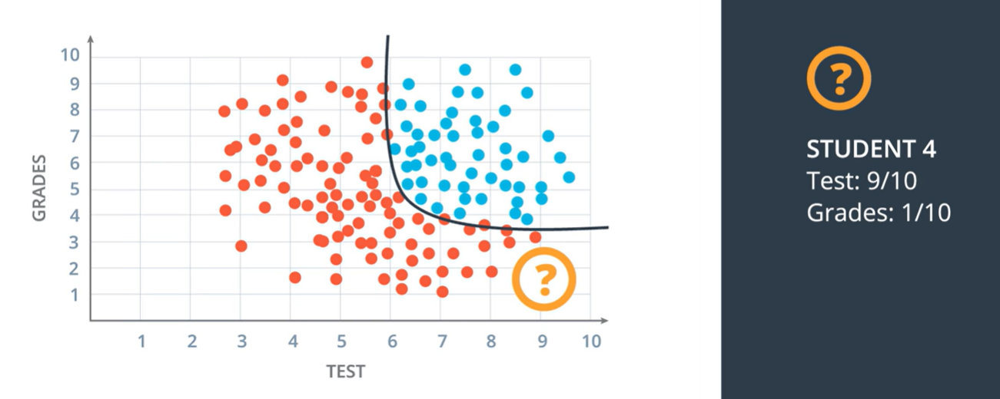

We need to define our perceptor algorithm in such a way so that it generalizes to other types of curves.

## Error functions
From now on we will use __Error function__. It tells us how far we are from the solution.

## Log-loss Error Function

Suppose we want to go to the bottom of a mountain (its cloudy and your visibility is limited) so at each step we will check and look around and based on that we will descend. This check for the shortest path down the mountain will be done at each step and the __error__ will be the height of that point i.e, distance between the bottom of the mountain and where we are standing after each descend.

This method is known as __Gradient descent__.

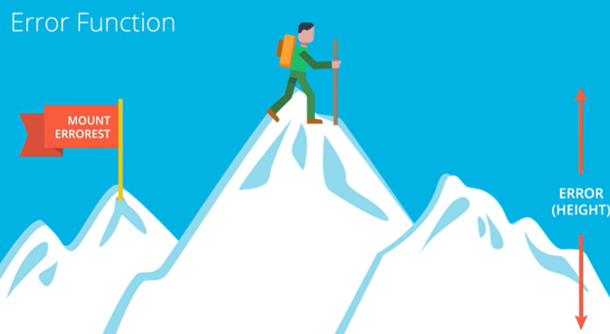

#### Goal Split data

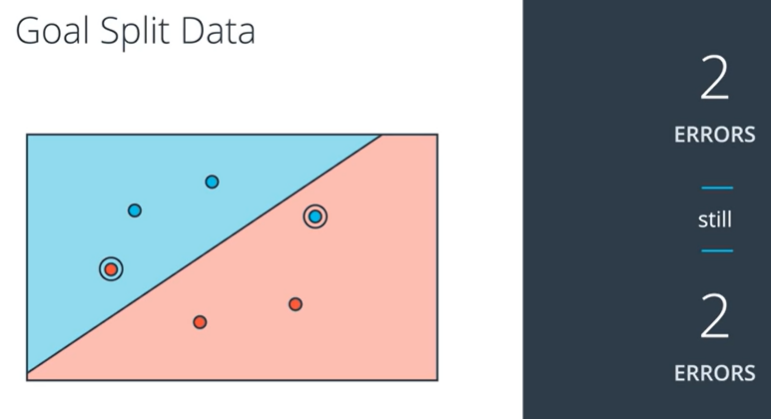

Now it will be difficult for the calculations to do the data split shown above quickly as the calculations use derivatives which are small steps.

#### Gradient descent on discrete vs continuous

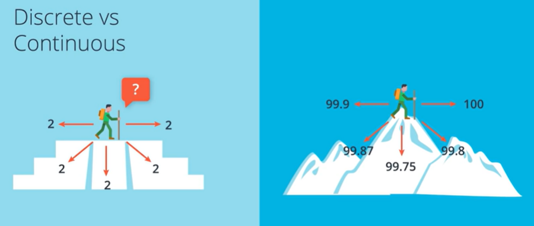

Also, its better to do gradient descent on continuous variables as it might not work well for discrete variables. For example:
- In case of discrete we will see ony 2 errors always (its like a pyramid with flat steps).
- In continuous we can detect small variations in height and can figure out in what direction the error function will decrease.


So what we need to do is to construct an error function which is continuous.  


The error function is going to assign a large penalty to two incorrectly classified points and small penalties to the incorrectly classified points. Penalty is large when the point is wrongly classifed and almost zero when the point is correctly classified.  (Lets assume the size of point is proportional to the penalty put on the points)

After applying gradient descent the error function will gradually become small.

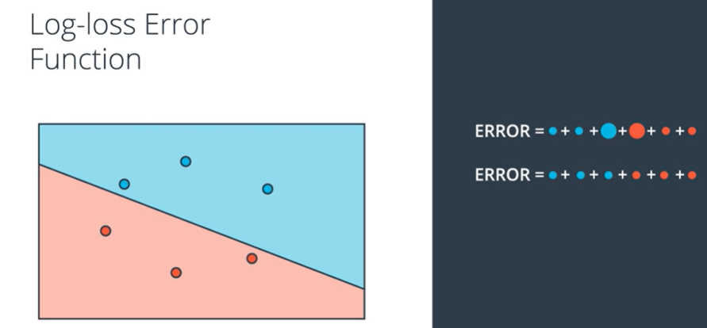

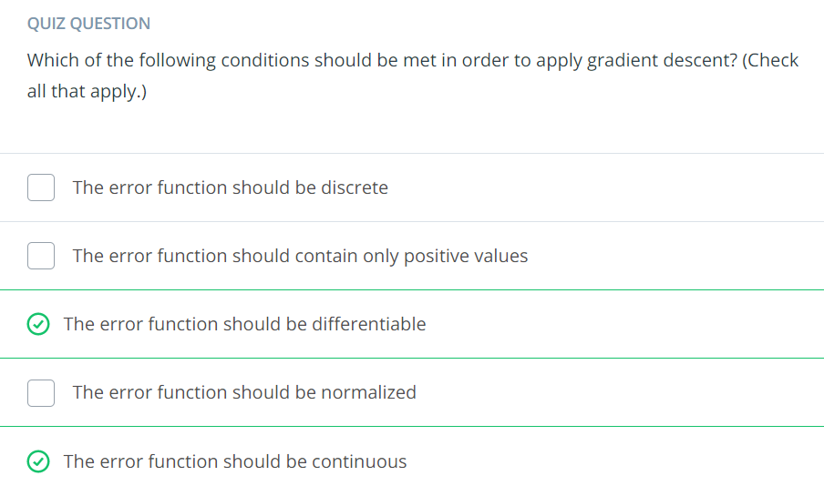

***

## Discrete vs Continuous Predictions

Above we learned that continuous error functions are better than discrete error functions, when it comes to optimizing. For this, we need to switch from discrete to continuous predictions.

Prediction is the answer which we get from out algorithm as output.

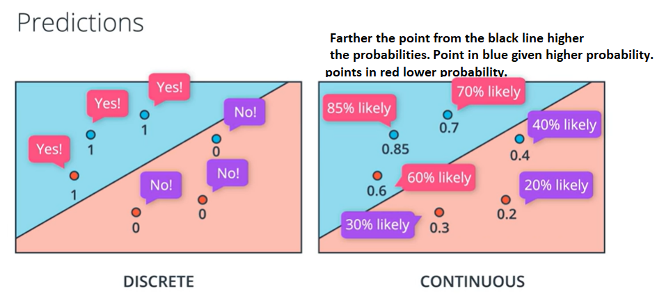

Point on the line are given 50% probabilities of being blue. The probabilities are function of the distance from the line. 

The way we move from discrete prediction to continuous prediction is to change our activation functions from step function to sigmoid function.

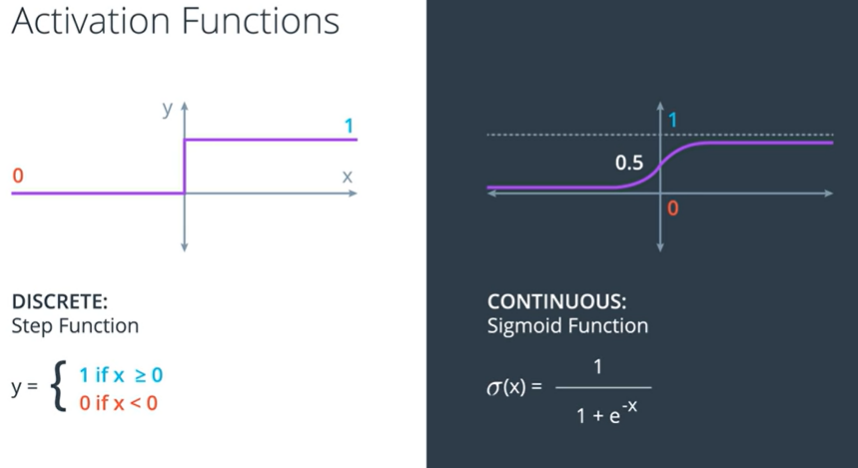

Sigmoid function will give us values close to 1 for large positive values.

Sigmoid function will give us negative values close to 0 for all negative values.

### Predictions

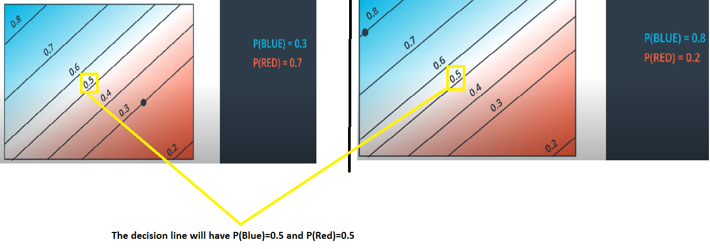

The way we obtain the probability space above is very simple. We just combine the linear function $Wx+b$ with the sigmoid function.

So in the left figure we have the lines that represent the points for which $Wx+b=0$ or 1,-1,-2,2,3,-3, etc. And then when we apply the sigmoid function to each of these values in the plane we then obtain the numbers from zero to one for each point. These numbers are just the probabilities of the point being in blue region - $\hat{y}$.

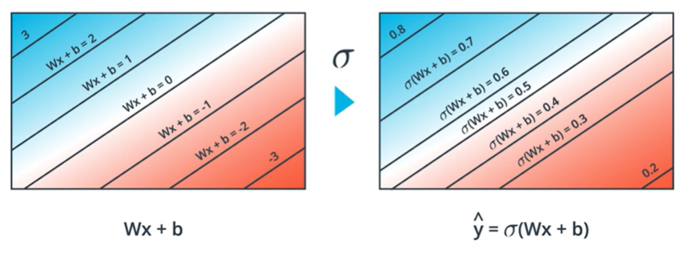

As we move closer to blue area the sigmoid will get closer to 1 and as we move closer to red area the sigmoid will get closer to 0.

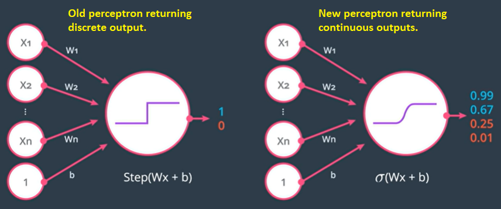

In the quiz below, the probability will be 0.5 if the score is $Wx+b=0$

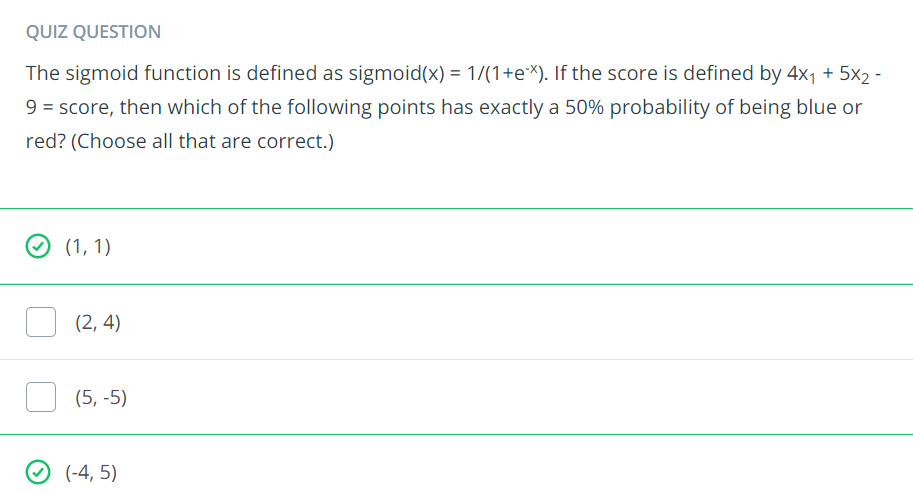

***

## The Softmax Function

We'll learn about the softmax function, which is the equivalent of the sigmoid activation function, but when the problem has 3 or more classes.

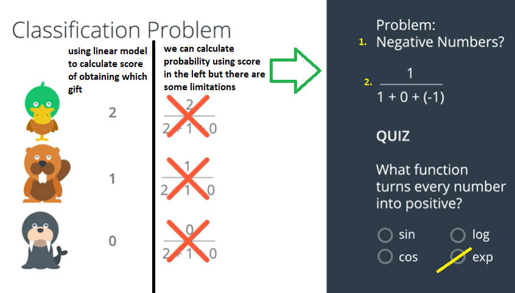

So we can use exponential function to deal with the effects of negative values and 0 in the denominator to calculate the probabilities.

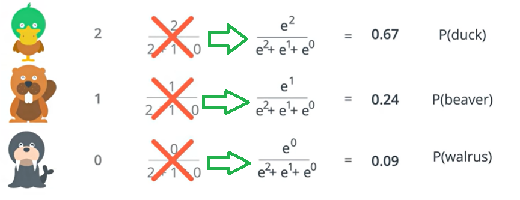

The function shown above is the __Softmax function__. 

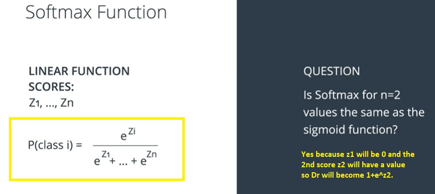

***

Check code for implementing the softmax function.

```

import numpy as np

# Write a function that takes as input a list of numbers, and returns
# the list of values given by the softmax function.

def softmax(L):
    expL = np.exp(L)
    sumExpL = sum(expL)
    result = []
    for i in expL:
        result.append(i*1.0/sumExpL)
    return result
    
    # Note: The function np.divide can also be used here, as follows:
    # def softmax(L):
    #     expL = np.exp(L)
    #     return np.divide (expL, expL.sum())
```

